## Prerequisites  

- [Set Up SAP BTP SDK for iOS](sdk-ios-setup)

## You will learn  

- How to create an app configuration on SAP Mobile Services Admin cockpit.
- Capabilities of Sample OData service provided by SAP Mobile Services.
- How to create an native iOS application using the SAP BTP SDK for iOS Assistant.
- Using the Online & Offline in the generated app.

---

[ACCORDION-BEGIN [Step 1: ](Create Server Side App Configuration)]

1. Go to your SAP Mobile Services account.

    

    > If stuck, please review the pre-requisites of this tutorial.

2. Click **Mobile Applications &rarr; Native/MDK** in the sidebar.

    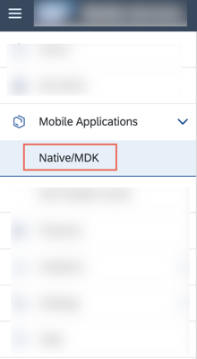

3. Click **New** located at the top right corner.

4. Use the following table to fill the details requested in the *New Application* Wizard.

    | Key | Value |
    |---|---|
    |ID|**`sdk.ios.assistant.app`**|
    |Name|**`iOS Assistant App`**|
    |Description|**`Reusable server-side app configuration for creating an app using iOS Assistant.`**|
    |Vendor|*No Change*|
    |License Type|*No Change*|
    |Domain of Application Route|*No Change*|

5. Click **Next**.

    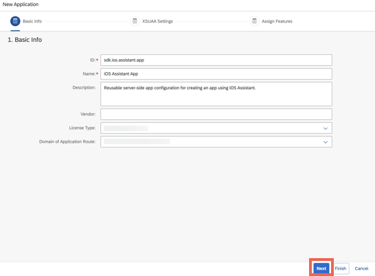

6. Click **Next** on the *XSUAA Settings* step of the Wizard without making any changes.

7. Select **Native Application** in the *Assign Features for* drop down menu.

8. Enable **Mobile Sample OData ESPM** by selecting the check box in the features table.

    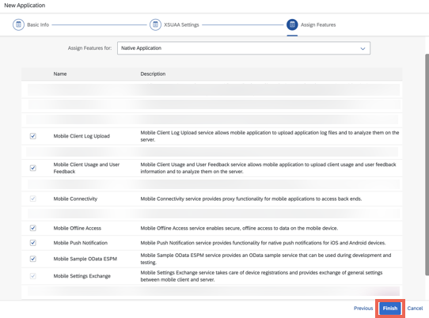

    > Click [here](https://help.sap.com/doc/f53c64b93e5140918d676b927a3cd65b/Cloud/en-US/docs-en/guides/features/backend-connectivity/common/sample.html) to learn more about the sample service.

9. Click **Finish**.

    > The app creation may take up to five minutes. Please wait for the app creation to complete successfully before moving to the next step.

[DONE]
[ACCORDION-END]

[ACCORDION-BEGIN [Step 2: ](Create an Xcode project using SAP BTP SDK Assistant for iOS)]

1. Launch SAP BTP SDK Assistant for iOS.

2. Click **Create New** located near the bottom left corner.

3. Click **Reuse Existing Application** in the project template step.

    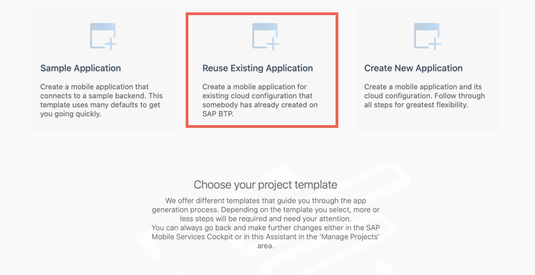

    > Click [here](https://help.sap.com/doc/f53c64b93e5140918d676b927a3cd65b/Cloud/en-US/docs-en/guides/getting-started/ios/creating-an-app.html#choose-your-project-template) to learn more about the different types of project templates.

4. Select the SAP Mobile Services account in which you created the server side configuration and click **Next**.

    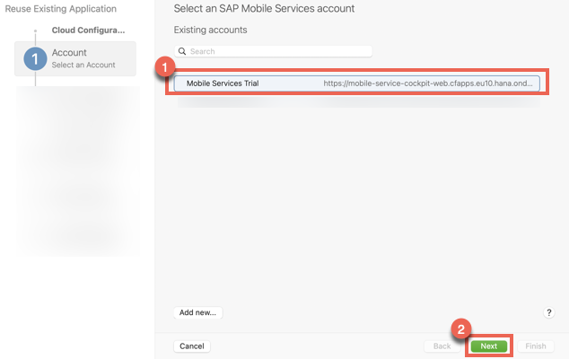

    > If stuck, please review the pre-requisites of this tutorial.

5. Use your SAP BTP credentials to complete the SSO login.

    > This task is only relevant if you chose SSO login during account set up. Click [here](https://help.sap.com/doc/f53c64b93e5140918d676b927a3cd65b/Cloud/en-US/docs-en/guides/getting-started/ios/creating-an-app.html#mobile-services-account) to learn more about the authentication type for SAP Mobile Services accounts.

6. Select the app you created in the first step and click **Next**.

    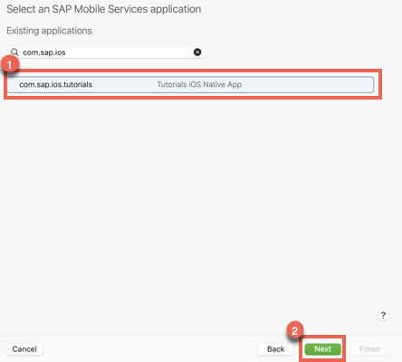

    > If you can't see your app, please check if the application has been created through the SAP Mobile Services admin cockpit.

7. Use your SAP BTP credentials to complete the SSO login.

    > This task is only relevant if you chose SSO login during account set up.

8. Use the following table to fill the project details requested in the *Provide the Xcode project configuration* step of the assistant, and click **Next**.

    | Key | Value |
    |---|---|
    |Product Name|**`my-first-app`**|
    |Organisation Name|**`iOS Assistant App`**|
    |Organisation Identifier|**`com.sap.ios`**|
    |Bundle Identifier|*Auto generated*|
    |Path|*No Change*|
    |Mac Catalyst|*No Change*|

9. Ensure `com.sap.edm.sampleservice.v2`is present in the *Configure the Proxy class generation process* step of the assistant, and click **Next**.

10. Keep the default settings in the *Configure the UI generation for the mobile application* step of the assistant, and click **Finish**.

    > After the project generation process is completed, the Xcode project will open. If prompted, click **Trust and Open** in the warning pop-up.

[DONE]
[ACCORDION-END]

[ACCORDION-BEGIN [Step 3: ](Examine the generated project)]

1. Open `my-first-app` &rarr; `my-first-app` &rarr; `Onboarding` &rarr; **`OnboardingFlowProvider`**.

    > You can use *Command* `⌘` + *Shift* `⇧` + O `o` and type the name of the file to open it quickly.

2. Search for `onboardingSteps` to view the function responsible for providing onboarding steps (e.g. Log In, User Consent, Passcode etc.) required by most enterprise mobile applications.

3. Open `my-first-app` &rarr; `my-first-app` &rarr; `ViewControllers` &rarr; `ESPMContainer` &rarr; **`Product`**.

4. You will have a storyboard file and two controller files configured to show a list detail view in the app. The assistant automatically creates these files for all the entities present in the Mobile Sample OData ESPM configured.

    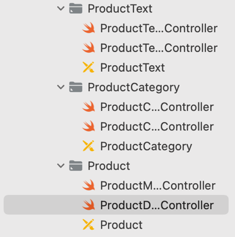

SAP BTP SDK Assistant for iOS has generated *Proxy Classes* for each entity of the specified OData service, generated *Views* and *View Controllers* and tied them together in the `Main.storyboard` file as well as dedicated `<Entity>.storyboard` files.

[VALIDATE_3]
[ACCORDION-END]

[ACCORDION-BEGIN [Step 4: ](Run the app)]

1. Click `▶` (Start the active scheme) in Xcode to run the application.

    

    > Configure the scheme to run the application on either a simulator or a device of your choice.

2. Click **`Start`** to start the onboarding process.

    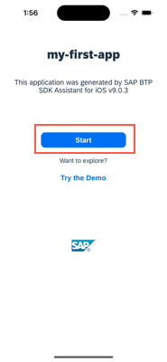

   > Wait for Xcode to deploy, install and run your application on the device before starting this task.

3. Enter your username and password.

    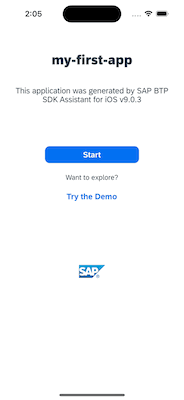

4. Accept user consent requests.

    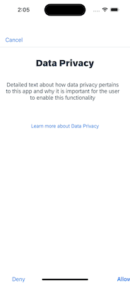

5. Configure a passcode.

    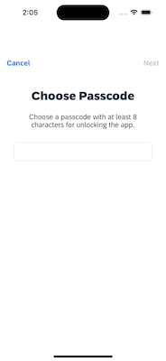

    > You may be prompted to set up Biometric authentication as we.. These policies can be defined on the SAP Mobile Services admin cockpit.

6. Allow the app to send push notifications.

    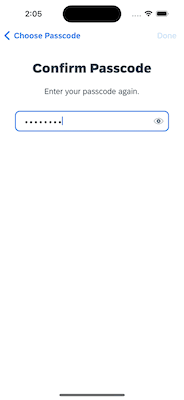

[DONE]
[ACCORDION-END]

[ACCORDION-BEGIN [Step 5: ](Edit a customer's details)]

1. Click **`ESPMContainer`**.

2. Click **`Customers`**.

3. Click any customer id.

    > This data is generated by the sample OData service and may differ from the tutorial.

4. Click **`Edit`** located on the top right corner.

5. Update the `FirstName` and `LastName`.

6. Click **`Done`** located on the top right corner.

The record gets updated and a confirmation toast message appears.

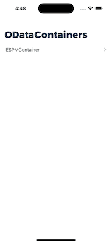

> You can verify the update by going to your SAP Mobile Services Cockpit &rarr; Mobile Applications &rarr; Native/MDK Application &rarr; `com.sap.ios.tutorials` &rarr; Assigned Features &rarr; Mobile Sample OData ESPM &rarr; `v2`.

[DONE]
[ACCORDION-END]

[ACCORDION-BEGIN [Step 6: ](Add a new supplier in offline mode)]

1. Turn off network connection on your device.

    > If the app is running on a device, turn on the Airplane mode.
    > If the app is running on a simulator, turn off the WiFi/Network of your computer.

2. Click **`ESPMContainer`**.

3. Click **`Suppliers`**.

4. Click **`➕`** located on the top right corner.

5. Add the requested details.

    | Key | Value |
    |---|---|
    |City|**`Walldorf`**|
    |Country|**`DE`**|
    |Email Address|**`supplier.email@sap.com`**|
    |House Number|**`15`**|
    |Phone Number|**`123456789`**|
    |Postal Code|**`111000`**|
    |Street|**`Old Street`**|
    |Supplier Id|**`Custom-new-supplierid123`**|
    |Supplier Name|**`New Custom Supplier`**|
    |Updated Timestamp|*No Change*|
    |Products|*No Change*|
    |Purchase Orders|*No Change*|

    > The `SupplierId` may be replaced with GUID after sync.

6. Click **`Done`** located on the top right corner.

    > Notice that the toast message says Created in offline mode.

7. Turn the on the network connection on your device.

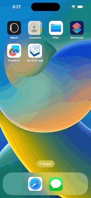

> After sync, you can verify the update by going to your SAP Mobile Services Cockpit.

Congratulations on successfully building an iOS application using the SAP BTP SDK Assistant for iOS that seamlessly connects to SAP Mobile Services.

[VALIDATE_6]
[ACCORDION-END]
