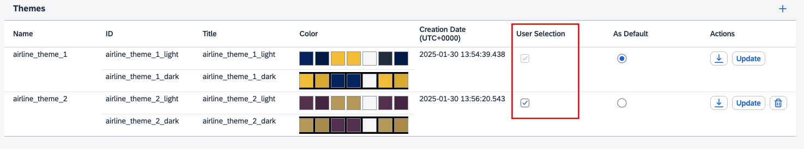
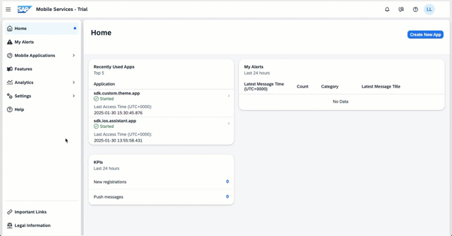

## Prerequisites

- [Set Up SAP BTP SDK for iOS](sdk-ios-setup)
- [Created Your First App using SAP BTP SDK Assistant for iOS](sdk-ios-assistant-app)

## Details

### You will learn  

- How to manage custom themes on SAP Mobile Services
- How to apply custom themes to a native iOS application

---

[ACCORDION-BEGIN [Step 1: ](Real world use case)]

You have built a native iOS application for the ground staff service technicians of an airline company.

Using the multi-tenancy capabilities of BTP and SAP Mobile Services, you are providing the software to two airline companies.

The airline teams are happy with your software, but they want the application to use the brand colours of their respective orgnisations.

You anticipate selling the software to more airlines in the future. Therefore, you don't want to maintain multiple code-lines with custom theme for each customer.

*In this tutorial, you will learn how to apply custom theme to your application without needing to re-deoply your native application. Click [here](https://help.sap.com/doc/f53c64b93e5140918d676b927a3cd65b/Cloud/en-US/docs-en/guides/features/application-themes/ios/theming.html) to learn more about themeing support on SAP BTP SDK iOS.*

[DONE]
[ACCORDION-END]

[ACCORDION-BEGIN [Step 2: ](Create or download custom themes)]

1. Use the links mentioned in the following table to download the light and dark variants of two themes.

    | Name  | Download Link |
    |---|---|
    | Air Line 1 Light Theme | [Download](/airline_theme_1_light.zip) |
    | Air Line 1 Dark Theme | [Download](/airline_theme_1_dark.zip) |
    | Air Line 2 Light Theme | [Download](/airline_theme_2_light.zip) |
    | Air Line 2 Dark Theme | [Download](/airline_theme_2_dark.zip) |

> You can create custom themes using the UI Theme designer. Click [here](cp-portal-freestyle-site-brand-site) to learn how to create custom themes using the UI Theme Designer on SAP Cloud Portal service.

[DONE]
[ACCORDION-END]

[ACCORDION-BEGIN [Step 3: ](Upload custom themes to SAP Mobile Services)]

1. Go to your SAP Mobile Services account.

    > If stuck, please review the pre-requisites of this tutorial.

2. Click Mobile Applications &rarr; Settings &rarr; **App Theme Manager** in the sidebar.

    

3. Click **`➕`** located on the top right corner.

4. Use the following table to add a new theme.

    | Key | Value |
    |---|---|
    |Theme Name|**`airline_theme_1`**|
    |Light Theme|Upload **`airline_theme_1_light.zip`**|
    |Dark Theme|Upload **`airline_theme_1_dark.zip`**|

5. Click **`Save`**.

6. Click **`➕`** again.

7. Use the following table to add another theme.

    | Key | Value |
    |---|---|
    |Theme Name|**`airline_theme_2`**|
    |Light Theme|Upload **`airline_theme_2_light.zip`**|
    |Dark Theme|Upload **`airline_theme_2_dark.zip`**|

8. Click **`Save`**.

9. Enable User Selection for both themes.

    

    > The theme marked default is always available for user selection and is applied to all apps that enable custom theme.

[VALIDATE_3]
[ACCORDION-END]

[ACCORDION-BEGIN [Step 4: ](Create a server side app configuration)]

1. Click **Mobile Applications &rarr; Native/MDK** in the sidebar.

2. Click **New** located at the top right corner.

3. Use the following table to fill the details requested in the *New Application* Wizard.

    | Key | Value |
    |---|---|
    |ID|**`sdk.custom.theme.app`**|
    |Name|**`Custom Theme App`**|
    |Description|**`Custom Theme App`**|
    |Vendor|*No Change*|
    |License Type|*No Change*|
    |Domain of Application Route|*No Change*|

4. Click **Next**.

5. Click **Next** on the *XSUAA Settings* step of the Wizard without making any changes.

6. Select **Native Application** in the *Assign Features for* drop down menu.

7. Enable **Mobile Sample OData ESPM** by selecting the check box in the features table.

8. Click **Finish**.

[DONE]
[ACCORDION-END]

[ACCORDION-BEGIN [Step 5: ](Enable a custom theme for your app on SAP Mobile Services)]

1. Click Assigned Features &rarr; **Mobile Settings Exchange**.

2. Enable **Enable Custom Theme** check-box under the Appearance section of the Client Configuration tab.

    

    > All themes uploaded in the App Theme Manager should be visible, and the default theme is set as Active.

[VALIDATE_5]
[ACCORDION-END]

[ACCORDION-BEGIN [Step 6: ](Allow anonymous access for your app on SAP Mobile Services)]

1. Click **Security** tab.

    

2. Enable **Allow Anonymous Access** check-box under the Anonymous Access section.

    

    > If it is already enabled, skip to Step 7.

3. Click **`➕`** located above the API Key Table.

4. Click **OK**.

    

    > If prompted, Click OK on the confirmation pop-up.

[VALIDATE_6]
[ACCORDION-END]

[ACCORDION-BEGIN [Step 7: ](Build a native app capable of applying themes on the fly)]

1. Launch SAP BTP SDK Assistant for iOS.

2. Click **Create New** located near the bottom left corner.

3. Click **Reuse Existing Application** in the project template step.

4. Select the SAP Mobile Services account in which you created the server side configuration and click **Next**.

    >If prompted, use your SAP BTP credentials to complete the SSO login.

5. Select the app you created in the second step and click **Next**.

    >If prompted, use your SAP BTP credentials to complete the SSO login.

6. Use the following table to fill the project details requested in the *Provide the Xcode project configuration* step of the assistant, and click **Next**.

    | Key | Value |
    |---|---|
    |Product Name|**`custom-theme-app`**|
    |Organisation Name|**`SAP`**|
    |Organisation Identifier|**`com.sap.ios`**|
    |Bundle Identifier|*Auto generated*|
    |Path|*No Change*|
    |Mac Catalyst|*No Change*|

7. Click **Next**.

8. Click **Finish**.

    > If prompted, click **Trust and Open** in the warning pop-up to open the newly created Xcode project.

[DONE]
[ACCORDION-END]

[ACCORDION-BEGIN [Step 8: ](Run the app)]

1. Click `▶` (Start the active scheme) in Xcode to run the application.

2. Toggle the appearance of your device from light to dark (or vice-versa).

    

    > Click [here](https://support.apple.com/en-us/HT210332) to see how you can toggle the appearance on a device. On a simulator, go to the Menu Bar &rarr; Features &rarr; **Toggle Appearance**.

[DONE]
[ACCORDION-END]

[ACCORDION-BEGIN [Step 9: ](Change the theme of your app on SAP Mobile Services)]

1. Go to your SAP Mobile Services account.

2. Click **Mobile Applications &rarr; Native/MDK** in the sidebar.

3. Click **sdk.custom.theme.app**.

4. Click Assigned Features &rarr; **Mobile Settings Exchange**.

5. Select the *Active radio button* for `airline_theme_2` under the *Appearance* section of the *Client Configuration* tab.

6. Click **Save**.

[DONE]
[ACCORDION-END]

[ACCORDION-BEGIN [Step 10: ](Re-launch the app to apply the new theme)]

1. Terminate the app previously running.

2. Re-launch the app.

3. Toggle the appearance of your device from light to dark (or vice-versa).

> The new application theme along with a new icon was applied without the app having to be re-deployed**.

[DONE]
[ACCORDION-END]

[ACCORDION-BEGIN [Step 11: ](Experience the theme on different screens)]

1. Click **Start**.

2. Toggle appearance layout.

3. Enter your username and password.

    > The custom theme is not applied to the log in screen since it is not a native screen.

4. Accept user consent requests.

5. Configure a passcode.

6. Allow the app to send push notifications.

    > The custom theme is not applied to OS managed screens.

7. Terminate the app.

8. Switch themes on SAP Mobile Services.

9. Re-launch the app.

10. Click **`ESPMContainer`**.

11. Toggle appearance layout.

12. Click **`Suppliers`**.

[VALIDATE_11]
[ACCORDION-END]

Congratulations on successfully completing the tutorial. You can now apply custom themes to native applications on the fly using SAP BTP SDK for iOS.
