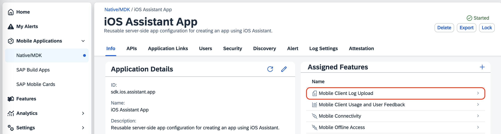
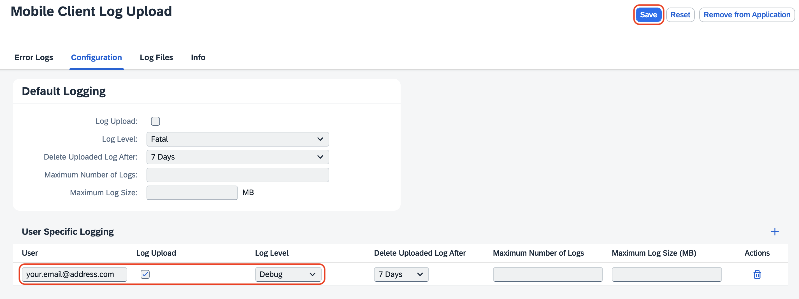
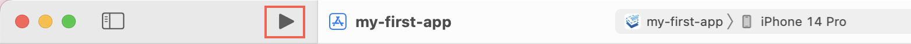

## Prerequisites  

- [Create your first app using the SAP BTP SDK for iOS Assistant](sdk-ios-assistant-app)

## You will learn

- To enable logging with the *SAP BTP SDK for iOS*
- About the capabilities of logging
- To upload logs and view them on *SAP Mobile Services*

---


[ACCORDION-BEGIN [Step 1: ](Real world use case)]


You've developed a native iOS application for airline ground staff service technicians using the *SAP BTP SDK for iOS*. Logging becomes your trusted ally in this scenario. 

Let's say a technician, John, encounters an issue where certain maintenance tasks are not being recorded properly in the application. He notices inconsistencies in the data and suspects there might be a bug or a synchronization issue.

By analyzing the logs generated by John's interactions with the application, you can pinpoint the exact steps he took leading up to the issue. You discover that there's indeed a synchronization issue occurring intermittently when John switches between online and offline modes.

With this insight from the logs, you're able to diagnose the problem accurately and implement a fix that ensures seamless synchronization regardless of the network status. This not only resolves John's issue but also improves the overall reliability of the application for all technicians, ultimately facilitating their tasks and ensuring smoother operations.

[DONE]
[ACCORDION-END]


[ACCORDION-BEGIN [Step 2: ](Learn about logging levels)]

There are different logging levels that can be used:

| Method | Description |
|---|---|
| debug | Behind-the-scenes details, only helpful for fixing specific code issues (disable by default!) |
| info | Regular app activity, tracks what's happening during normal operation |
| warn | Something unexpected but not critical, the app can continue (use with caution) |
| error | The app hit a snag and can't proceed with the current task (e.g., network issues, failed database operations) |


Logging functionality is provided by the *SAP BTP SDK for iOS* through it's *Logger* class. This class is defined in *`SAPCommon`* and will be referenced when creating an application with the help of the *SAP BTP SDK Assistant for iOS*. 

The [documentation](https://help.sap.com/doc/978e4f6c968c4cc5a30f9d324aa4b1d7/Latest/en-US/Documents/Frameworks/SAPCommon/Logging.html) provides more information about this class.

[VALIDATE_2]
[ACCORDION-END]


[ACCORDION-BEGIN [Step 3: ](Define Logging Levels)]

Following you will add a logging statement indicating that the application view was successfully loaded.

1. Open your View Controller and locate the function **`override func viewDidLoad()`** 

2. Add a logging statement that will output a debug log:

    ```swift
    override func viewDidLoad() {
        super.viewDidLoad()
        
        self.logger.debug("Demo application successfully loaded")

        //...
    }
    ```

3. (Optional) In addition to plain text, you can also supply an optional *error* object. Refer to the [documentation](https://help.sap.com/doc/978e4f6c968c4cc5a30f9d324aa4b1d7/Latest/en-US/Documents/Frameworks/SAPCommon/Logging.html) for more details.

    ```swift
    if let error = error {
        self.logger.error("An error happened: ", error: error)
    }
    ```

    >If you can't reference the *`logger`* object make sure *`SAPCommon`* is imported and got initiated in the View controller. It should look like this:

    ```swift
    import SAPCommon

    class MyViewController: UIViewController {

        private let logger = Logger.shared(withName: "MyViewController")
        
    }
    ```

[DONE]
[ACCORDION-END]

[ACCORDION-BEGIN [Step 4: ](Examine Logging Settings in SAP Mobile Services)]

1. Open up *SAP Mobile Services Cockpit*.
2. Click **Mobile Applications** and **Native/MDK**.
3. Find the Application that you created before in this tutorial and select it.
4. Open **Mobile Client Log Upload** under *Assigned Features*.
    
    

    > It is recommended to enable logging for specific users only. Due to a possibly large amount of data that will be created it only has a value in specific circumstances. 

5. In the *Configuration* tab press the **+** button to add a new logging user.

6. Enter the e-mail address used to log-in to the application in the **User** field, enable **Log Upload** and select **Debug** as a Log Level.

    

7. Press **Save** in the top right corner.

    >You can find more information in the [documentation](https://help.sap.com/docs/mobile-services/mobile-services-neo/defining-client-log-policy).

[VALIDATE_4]
[ACCORDION-END]


[ACCORDION-BEGIN [Step 5: ](Run the app)]

> If you logged in before the app will be already configured and it is only necessary to unlock it.

1. Click `▶` (Start the active scheme) in Xcode to run the application.

    

    > Configure the scheme to run the application on either a simulator or a device of your choice.

2. Click **`Start`** to begin the onboarding process.

    > Wait for Xcode to deploy, install and run your application on the device before starting this task.

3. Enter your username and password.

4. Accept user consent requests.

5. Configure a passcode.

    > You may be prompted to set up Biometric authentication. These policies can be defined on the *SAP Mobile Services* admin cockpit.

6. Allow the app to send push notifications.

[DONE]
[ACCORDION-END]


[ACCORDION-BEGIN [Step 6: ](View Logs in SAP Mobile Services)]

1. Open up *SAP Mobile Services Cockpit*.
2. Click **Mobile Applications** and **Native/MDK**.
3. Find the Application that you created before and select it.
4. Open **Mobile Client Log Upload** under *Assigned Features*.

    

5. Open the **Log Files** tab and find the user name you used to sign in to the created app.

    > If your user name doesn't show up, restart the mobile application on your phone or emulator as the logs are uploaded when the app starts by default.

6. Select the Log Files you want to analyze and click **Download**.

    

7. Use your preferred *JSON* viewer to open the downloaded file.


Congratulations on enabling logging and viewing the logs uploaded from your *SAP BTP SDK for iOS* application in *SAP Mobile Services*. 

[VALIDATE_6]
[ACCORDION-END]

