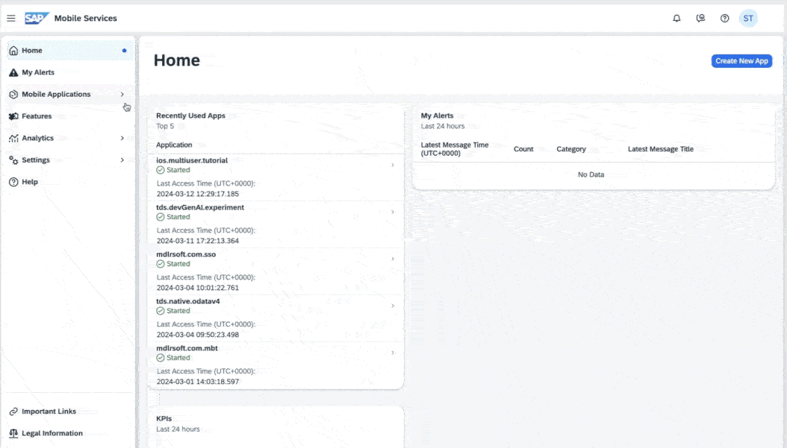
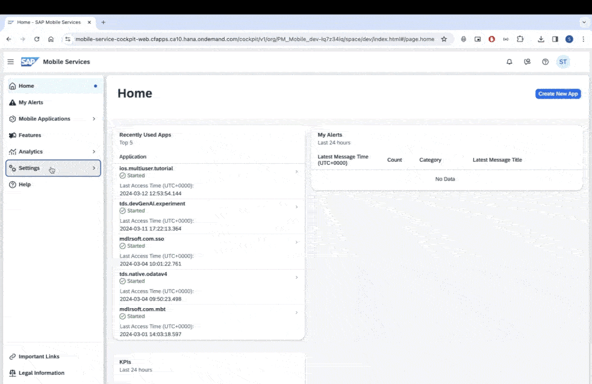
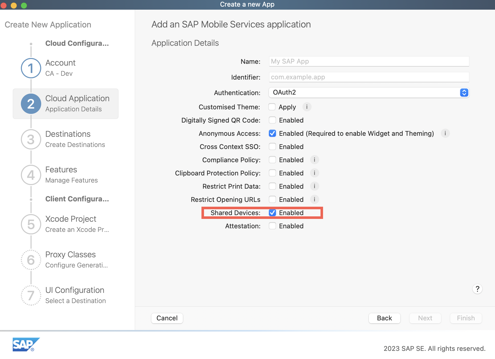
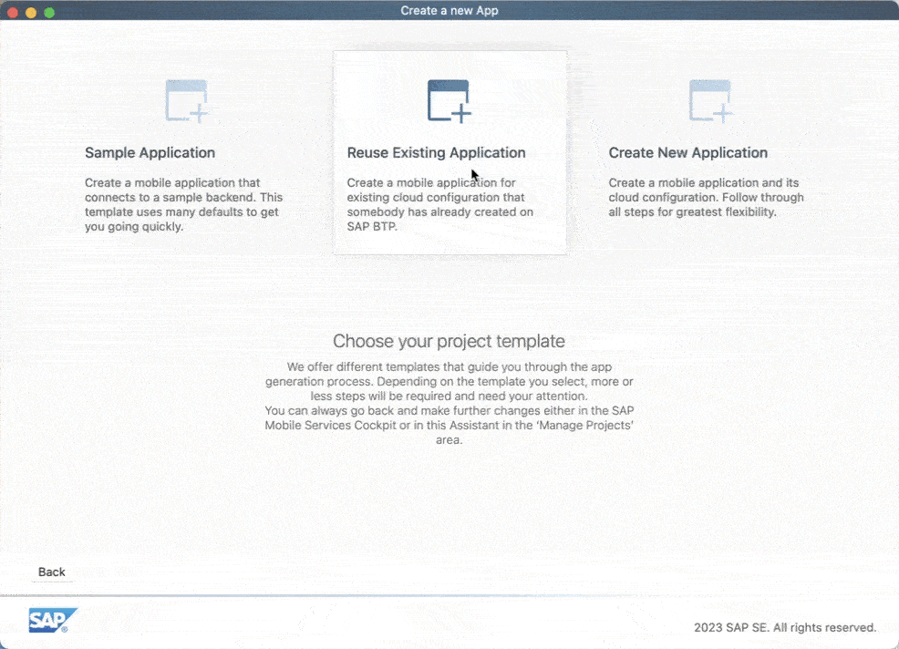
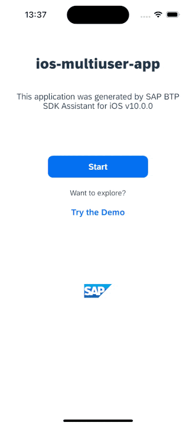

## Prerequisites

- SAP BTP SDK for iOS **9.1** or higher
- [Set Up SAP BTP SDK for iOS](sdk-ios-setup)
- [Created Your First App using SAP BTP SDK Assistant for iOS](sdk-ios-assistant-app)

## You will learn

- How to create an offline enabled iOS application that supports multiple users on the same device

---

[ACCORDION-BEGIN [Step 1: ](Real world use case)]

An air carrier organisation uses an iOS application built using SAP BTP SDK for iOS to keep a track of an aircraft's vital information (Fuel Level, Tyre Pressure, etc.) before each flight. The application must support offline use-case to comply with the network regulations at the airport. Since the airline has flights departing round the clock, it deploys ground staff in three 8-hour shifts. To maximise efficiency, the organisation wants ground staff to share mobile devices.

The ground staff members want a solution that is reliable even in the absence of network. They also aren't keen on logging out and logging in every time a shift ends, as they believe this could lead to erroneous data.

In this tutorial, you will learn how to enhance your [SAP BTP SDK for iOS Assistant](https://developers.sap.com/trials-downloads.html?search=SAP+BTP+SDK+for+iOS) generated application to create an offline enabled application that supports multiple users.

[DONE]
[ACCORDION-END]

[ACCORDION-BEGIN [Step 2: ](Enable multi-user mode in mobile services cockpit)]

1. In your mobile services account, click Mobile Applications &rarr; Native/MDK &rarr; **< Your Mobile Application configuration >**.

2. Under Assigned Features, click **Mobile Settings Exchange**.

    > Assigned features can be found under the Info tab.

3. Under Shared Devices section, enable the *Allow Upload of Pending Changes from Previous User (Enable Multiple User Mode):* checkbox.

    > A multi-user application can be either an online only or  an offline-enabled app depending on the features assigned on to the configuration on the Mobile Services Admin UI.

[VALIDATE_2]
[ACCORDION-END]

[ACCORDION-BEGIN [Step 3: ](Configure trust)]

In the given scenario any pending changes done by a user should be uploaded before another user signs in. Thus, you must configure trust to enable upload of pending changes from previous users of mobile applications.

1. Open your mobile services account.

2. In the Side Navigation Bar, click Settings &rarr; **Security**.

3. Click **Metadata Download**.

    > `NoAuth` authentication type is not supported. Even if multi-user mode is turned on, an application using the `NoAuth` authentication type will revert to single user mode.

4. Go to your sub account on SAP BTP.

5. In the Side Navigation Bar, click Security &rarr; **Trust Configuration**.

6. Click **New Trust Configuration**.

7. Click **Upload**, and select the XML file downloaded in the earlier step.

8. Enter a name, and click **Save**.

[DONE]
[ACCORDION-END]

[ACCORDION-BEGIN [Step 4: ](Create an Xcode project using SAP BTP SDK Assistant for iOS)]

1. Launch SAP BTP SDK Assistant for iOS.

2. Click **Create New** located near the bottom left corner.

3. Click **Reuse Existing Application** in the project template step.

    > You can also select the "Create New Application" option and enable Shared Device in the Cloud Application step.
    >  

4. Select the SAP Mobile Services account in which you created the server side configuration and click **Next**.

5. Use your SAP BTP credentials to complete the SSO login.

6. Select the app you created in the earlier step and click **Next**.

7. Use the following table to fill the project details requested in the *Provide the Xcode project configuration* step of the assistant, and click **Next**.

    | Key | Value |
    |---|---|
    |Product Name|**`ios-multiuser-app`**|
    |Organisation Name|**`SAP`**|
    |Organisation Identifier|**`com.sap`**|
    |Bundle Identifier|*Auto generated*|
    |Path|*No Change*|
    |Mac Catalyst|*No Change*|

8. Ensure `com.sap.edm.sampleservice.v2`is present in the *Configure the Proxy class generation process* step of the assistant, and click **Next**.

9.  Use the following table to configure the settings in the *Configure the UI generation for the mobile application* step of the assistant, and click **Finish**.

    | Key | Value |
    |---|---|
    |Onboarding|**Enabled**|
    |Master/Detail Screens for all Destinations|**Enabled**|
    |Application Extension|**Disabled**|
    |Enable Multi-Window Support|*No (`AppDelegate` only)*|

    > After the project generation process is completed, the Xcode project will open. If prompted, click **Trust and Open** in the warning pop-up.

[DONE]
[ACCORDION-END]

[ACCORDION-BEGIN [Step 5: ](Build and run the application)]

1. In the menu bar, click Product &rarr; **Build**.

    > Any errors you see will be cleared after building the project.

2. Select a suitable simulator/device and run your project.

[DONE]
[ACCORDION-END]

[ACCORDION-BEGIN [Step 6: ](Onboard multiple users)]

1. Click **Start**.

2. Enter *username* and *password*, and click **Log On**.

    > Select the appropriate identity provider if you have configured more than one on BTP.

3. Complete the Onboarding by granting the necessary privileges.

4. Configure a *passcode* for the first user.

    > Please note that apps utilizing Shared Device Mode do not support disabling the passcode policy or Biometric authentication.

6. Terminate the app or Send the app to background.

7. In the sign in screen, click **Switch or Add User**.

8.  Click  to add a new user.
    > Ensure all users being onboarded have access to the BTP account. You can configure this in the users section under security on your SAP BTP sub-account.

9.  Follow the onboarding flow for the second user.
    
    > Each user must configure their own passcode which they will use to access the application.

10. Terminate the app or Send the app to background.

11. In the sign in screen, click **Switch or Add User**.

12. Select a different user.

13. Enter the selected user's passcode.

[VALIDATE_6]
[ACCORDION-END]

[ACCORDION-BEGIN [Step 7: ](Try offline scenario)]

1. Sign into User A's account.

2. Turn off your network.

    > If you are running a simulator, turn off your parent system's WiFi.

3. Update an entry.

4. Terminate the app.

5. Turn on your network.

6. Sign in using User B's account.

7. Verify the change done by user A.

In this step you've seen how the changes done by User A are not lost even when they were done in the absence of network.

Congratulations on completing the tutorial!

[DONE]
[ACCORDION-END]

---
