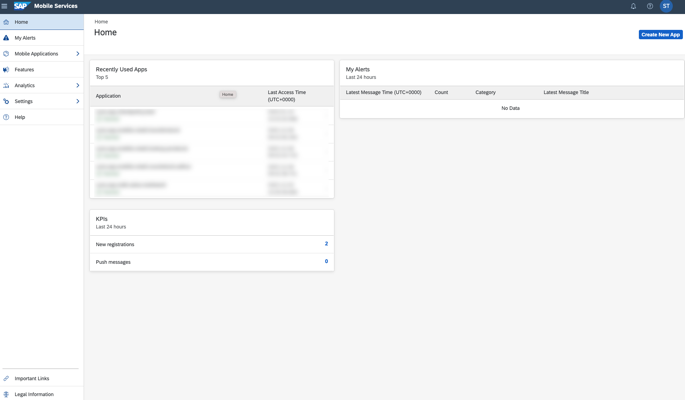

## Prerequisites

- SAP BTP SDK for iOS **9.1** or higher
- [Set Up SAP BTP SDK for iOS](sdk-ios-setup)
- [Created Your First App using SAP BTP SDK Assistant for iOS](sdk-ios-assistant-app)

## Details

### You will learn

- How to create an offline enabled iOS application that supports multiple users on the same device

---

[ACCORDION-BEGIN [Step 1: ](Real world use case)]

An air carrier organisation uses an iOS application built using SAP BTP SDK for iOS to keep a track of an aircraft's vital information (Fuel Level, Tyre Pressure, etc.) before each flight. The application must support offline use-case to comply with the network regulations at the airport. Since the airline has flights departing round the clock, it deploys ground staff in three 8-hour shifts. To maximise efficiency, the organisation wants ground staff to share mobile devices.

The ground staff members want a solution that is reliable even in the absence of network. They also aren't keen on logging out and logging in every time a shift ends, as they believe this could lead to erroneous data.

In this tutorial, you will learn how to enhance your [SAP BTP SDK for iOS Assistant](https://developers.sap.com/trials-downloads.html?search=SAP+BTP+SDK+for+iOS) generated application to create an offline enabled application that supports multiple users.

[DONE]
[ACCORDION-END]

[ACCORDION-BEGIN [Step 2: ](Enable multi-user mode in mobile services cockpit)]

1. In your mobile services account, click Mobile Applications &rarr; Native/Hybrid &rarr; **< Your Mobile Application configuration >**.

    

2. Under Assigned Features, click **Mobile Settings Exchange**.

    

    > Assigned features can be found under the Info tab.

3. Under Shared Devices section, enable the *Allow Upload of Pending Changes from Previous User (Enable Multiple User Mode):* checkbox.

    

    > A multi-user application needs to be an offline-enabled app so that the local store can be used to preserve user data.

[VALIDATE_2]
[ACCORDION-END]

[ACCORDION-BEGIN [Step 3: ](Configure trust)]

In the given scenario any pending changes done by a user should be uploaded before another user signs in. Thus, you must configure trust to enable upload of pending changes from previous users of mobile applications.

1. Open your mobile services account.

    

2. In the Side Navigation Bar, click Settings &rarr; **Security**.

    

3. Click **Metadata Download**.

    

    > `NoAuth` authentication type is not supported. Even if multi-user mode is turned on, an application using the `NoAuth` authentication type will revert to single user mode.

4. Go to your sub account on SAP BTP.

    

5. In the Side Navigation Bar, click Security &rarr; **Trust Configuration**.

    

6. Click **New Trust Configuration**.

    

7. Click **Upload**, and select the XML file downloaded in the earlier step.

    

8. Enter a name, and click **Save**.

    

[DONE]
[ACCORDION-END]

[ACCORDION-BEGIN [Step 4: ](Create an Xcode project using SAP BTP SDK Assistant for iOS)]

1. Launch SAP BTP SDK Assistant for iOS.

2. Click **Create New** located near the bottom left corner.

3. Click **Reuse Existing Application** in the project template step.

4. Select the SAP Mobile Services account in which you created the server side configuration and click **Next**.

5. Use your SAP BTP credentials to complete the SSO login.

6. Select the app you created in the earlier step and click **Next**.

7. Use the following table to fill the project details requested in the *Provide the Xcode project configuration* step of the assistant, and click **Next**.

    | Key | Value |
    |---|---|
    |Product Name|**`ios-multiuser-app`**|
    |Organisation Name|**`SAP`**|
    |Organisation Identifier|**`com.sap`**|
    |Bundle Identifier|*Auto generated*|
    |Path|*No Change*|
    |Mac Catalyst|*No Change*|

8. Ensure `com.sap.edm.sampleservice.v2`is present in the *Configure the Proxy class generation process* step of the assistant, and click **Next**.

9. Use the following table to configure the settings in the *Configure the UI generation for the mobile application* step of the assistant, and click **Finish**.

    | Key | Value |
    |---|---|
    |Onboarding|**Enabled**|
    |Master/Detail Screens for all Destinations|**Enabled**|
    |Application Extension|**Disabled**|
    |Enable Multi-Window Support|*No (`AppDelegate` only)*|

    > After the project generation process is completed, the Xcode project will open. If prompted, click **Trust and Open** in the warning pop-up.

[DONE]
[ACCORDION-END]

[ACCORDION-BEGIN [Step 5: ](Configure app parameters)]

1. In Xcode, Open **`AppParameters.plist`**.

2. Add a new parameter by providing the following key/value.

    |  Key   | Type | Value |
    |  :------------- | :------------- | :------------- |
    |  User Mode | String | Multiple |

      

[DONE]
[ACCORDION-END]

[ACCORDION-BEGIN [Step 5: ](Modify AppDelegate for multi-user callbacks)]

1. Open `AppDelegate.swift`.

2. Add a public variable `userDidChange`.

    ```swift
    // Boolean to ensure addUser/switchUser happened
    private var userDidChange = false
    ```

3. Replace the `applicationWillEnterForeground` function with the given code to trigger multi-user flow.

    ```Swift
    func applicationWillEnterForeground(_: UIApplication) {
        // Triggers to show the passcode screen
        OnboardingSessionManager.shared.unlock { error in
            if self.userDidChange {
                self.afterOnboard()
                self.userDidChange = false
            }

            self.onboardingErrorHandler?.handleUnlockingError(error)
        }
    }
    ```

4. Replace the `initializeOnboarding` function with the following code to configure `OnboardingSessionManager` with `MultiUserOnboardingIDManager`.

    ```Swift
    func initializeOnboarding() {
        let presentationDelegate = ApplicationUIManager(window: window!)
        onboardingErrorHandler = OnboardingErrorHandler()
        sessionManager = OnboardingSessionManager(presentationDelegate: presentationDelegate, flowProvider: flowProvider, onboardingIDManager: MultiUserOnboardingIDManager(), delegate: onboardingErrorHandler)
        presentationDelegate.isOnboarding = true
        presentationDelegate.showSplashScreenForOnboarding { _ in }

        onboardUser()
    }
    ```

5. Add an extension for `AppDelegate` for multi-user callbacks.

    ```swift
    extension AppDelegate: UserEventObserving {
        func userAdded(with onboardingID: UUID) {
            logger.debug("Called: userAdded")
            self.userDidChange = true
        }

        func userSwitched(to onboardingID: UUID) {
            logger.debug("Called: userSwitched")
            self.userDidChange = true
        }
    }
    ```

[DONE]
[ACCORDION-END]

[ACCORDION-BEGIN [Step 6: ](Modify OnboardingFlowProvider for reset passcode flow)]

1. Open `OnboardingFlowProvider.swift`.

2. Replace the `flow` function with the given code to add a `resetPasscode` case.

    ```swift
    public func flow(for _: OnboardingControlling, flowType: OnboardingFlow.FlowType, completionHandler: @escaping (OnboardingFlow?, Error?) -> Void) {
        switch flowType {
        case .onboard:
            completionHandler(onboardingFlow(), nil)
        case let .restore(onboardingID):
            completionHandler(restoringFlow(for: onboardingID), nil)
        case .background:
            completionHandler(nil, nil)
        case let .reset(onboardingID):
            completionHandler(resettingFlow(for: onboardingID), nil)
        case let .resetPasscode(onboardingID):
            completionHandler(resetPasscodeFlow(for: onboardingID), nil)
        @unknown default:
            break
        }
    }
    ```

3. Add a new function `resetPasscodeFlow`.

    ```swift
    func resetPasscodeFlow(for onboardingID: UUID) -> OnboardingFlow {
        let steps = resetPasscodeSteps
        var context = OnboardingContext(presentationDelegate: OnboardingFlowProvider.modalUIViewControllerPresenter)
        let flow = OnboardingFlow(flowType: .resetPasscode(onboardingID: onboardingID), context: context, steps: steps)
        return flow
    }
    ```

4. Add a new public `resetPasscodeSteps` property.

    ```swift
    public var resetPasscodeSteps: [OnboardingStep] {
        return onboardingSteps
    }
    ```

[DONE]
[ACCORDION-END]

[ACCORDION-BEGIN [Step 7: ](Provide path for offline store)]

1. Open **`ODataControlling.Swift`**.

2. Import `SAPOfflineOData`

    ```Swift
    import SAPOfflineOData
    ```

3. Replace the `ODataControlling` protocol with the following code to add a new protocol for `configureOData`:

    ```Swift
    public protocol ODataControlling {
        func configureOData(sapURLSession: SAPURLSession, serviceRoot: URL) throws
        func configureOData(sapURLSession: SAPURLSession, serviceRoot: URL, onboardingID: UUID) throws
        func configureOData(sapURLSession: SAPURLSession, serviceRoot: URL, onboardingID: UUID, offlineParameters: OfflineODataParameters) throws
        func openOfflineStore(synchronize: Bool) async throws
    }
    ```

4. Add `configureOData` method with `OfflineParameters` in `ODataControlling` extension.

    ```swift
    func configureOData(sapURLSession _: SAPURLSession, serviceRoot _: URL, onboardingID _: UUID, offlineParameters: OfflineODataParameters) throws {
        // OfflineODataController will override this default implementation.
    }
    ```

5. Create a new file `OfflineODataControllerError.swift` under `Frameworks` &rarr; `SharedFmwk`&rarr; `SharedFmwk`.

6. Add the following code to the newly created `OfflineODataControllerError.swift` file.

    ```swift
    import SAPCommon

    public enum OfflineODataControllerError: Error {
        case cannotCreateOfflinePath
        case storeClosed
        case syncFailed
    }

    extension OfflineODataControllerError: SAPError {
        public var description: String {
            switch self {
            case .cannotCreateOfflinePath:
                return "OfflineODataControllerError.cannotCreateOfflinePath: Unable to create offline path."
            case .storeClosed:
                return "OfflineODataControllerError.storeClosed: Store is closed."
            case .syncFailed:
                return "OfflineODataControllerError.syncFailed: Sync has failed."
            }
        }

        public var debugDescription: String {
            return description
        }

        public var errorDescription: String? {
            return description
        }

        public var failureReason: String? {
            return description
        }
    }
    ```

7. Open **`ESPMContainerOfflineODataController.Swift`**.

8. Remove the `Error enum`.

    ```swift
    enum Error: Swift.Error {
        case cannotCreateOfflinePath
        case storeClosed
    }
    ```

9. Replace the `offlineStorePath` function with the following code to use `OfflineODataControllerError`:

    ```swift
    public static func offlineStorePath(for onboardingID: UUID) throws -> URL {
        guard let documentsFolderURL = FileManager.default.urls(for: FileManager.SearchPathDirectory.documentDirectory, in: FileManager.SearchPathDomainMask.userDomainMask).first else {
            throw OfflineODataControllerError.cannotCreateOfflinePath
        }
        let offlineStoreURL = documentsFolderURL.appendingPathComponent(onboardingID.uuidString).appendingPathComponent("ESPMContainer")
        return offlineStoreURL
    }
    ```

10. Add a new function `createStore`.

    ```swfit
    public static func createStore(for onboardingID: UUID) throws -> URL {
        let offlinePath = try offlineStorePath(for: onboardingID)
        try FileManager.default.createDirectory(at: offlinePath, withIntermediateDirectories: true)
        return offlinePath
    }
    ```

11. Replace the `configureOData` function with the following code to use the `createStore` function:

    ```swift
    public func configureOData(sapURLSession: SAPURLSession, serviceRoot: URL, onboardingID: UUID, offlineParameters: OfflineODataParameters) throws {
        // Configure the path of the Offline Store
        offlineParameters.storePath = try ESPMContainerOfflineODataController.createStore(for: onboardingID)

        // Setup an instance of delegate. See sample code below for definition of OfflineODataDelegateSample class.
        let offlineODataProvider = try! OfflineODataProvider(serviceRoot: serviceRoot, parameters: offlineParameters, sapURLSession: sapURLSession, delegate: delegate)
        try configureDefiningQueries(on: offlineODataProvider)
        dataService = ESPMContainer(provider: offlineODataProvider.syncProvider)
    }
    ```

[DONE]
[ACCORDION-END]

[ACCORDION-BEGIN [Step 8: ](Configure offline store)]

1. Create a new file `OfflineOdataMultiUserUtils.swift` under `<Project Name>` &rarr; `Utils`.

2. Add the following code to the newly created `OfflineOdataMultiUserUtils.swift` file.

    ```swift
    import SAPFoundation
    import SAPOfflineOData
    import SAPFioriFlows

    class OfflineODataMultiuserUtils {
        private static let offlineStoreNameKey: String = "SAP.OfflineOData.MultiUser"
        
        static func getOfflineODataParameters(using context: OnboardingContext) -> OfflineODataParameters {
            if UserManager.userMode == .multiUser,
                let onboardedUser = UserManager().get(forKey: context.onboardingID),
                let userId = onboardedUser.infoString {
                let offlineParameters = OfflineODataParameters()
                offlineParameters.storeEncryptionKey = try? context.credentialStore.get(String.self, for: EncryptionConfigLoader.encryptionKeyID)
                if let enabled = (context.info[.sapcpmsSharedDeviceSettings] as? SAPcpmsSharedDeviceSettings)?.allowUploadPendingChangesFromPreviousUser, enabled {
                    offlineParameters.forceUploadOnUserSwitch = enabled
                    offlineParameters.currentUser = userId
                }
                return offlineParameters
            } else {
                fatalError("Failed to fetch user information!")
            }
        }
        
        static func offlineStoreID() -> UUID {
            var offlineStoreName: String? = UserDefaults.standard.value(forKey: self.offlineStoreNameKey) as? String
            if offlineStoreName == nil {
                offlineStoreName = UUID().uuidString
                UserDefaults.standard.set(offlineStoreName, forKey: self.offlineStoreNameKey)
            }
            let offlineStoreNameID: UUID = UUID(uuidString: offlineStoreName!)!
            return offlineStoreNameID
        }
    }
    ```

3. Open **`ODataOnboardingStep.Swift`**.

4. Import `SAPOfflineOData`

    ```Swift
    import SAPOfflineOData
    ```

5. Replace the `reset` function with the following code to use `OfflineODataMultiuserUtils`.

    ```swift
    public func reset(context: OnboardingContext, completionHandler: @escaping () -> Void) {
        defer { completionHandler() }
        do {
            try ESPMContainerOfflineODataController.removeStore(for: OfflineODataMultiuserUtils.offlineStoreID())        
        } catch {
            logger.error("Remove Offline Store failed", error: error)
        }
    }
    ```

6. Add `resetPasscode` function.

    ```swift
    public func resetPasscode(context: OnboardingContext, completionHandler: @escaping (OnboardingResult) -> Void) {
        configureOData(using: context, completionHandler: completionHandler)
    }
    ```

7. Replace the `configureOData` function with the following code to pass the `offlineStore` parameters:

    ```swift
    private func configureOData(using context: OnboardingContext, completionHandler: @escaping (OnboardingResult) -> Void) {
        let banner = topBanner()
        let group = DispatchGroup()
        var odataControllers = [String: ODataControlling]()
        let destinations = FileConfigurationProvider("AppParameters").provideConfiguration().configuration["Destinations"] as! NSDictionary

        let eSPMContainerOfflineODataDelegateSample = OfflineODataDelegateSample(for: "ESPMContainer", with: banner)
        odataControllers[ODataContainerType.eSPMContainer.description] = ESPMContainerOfflineODataController(delegate: eSPMContainerOfflineODataDelegateSample)

        for (odataServiceName, odataController) in odataControllers {
            group.enter()
            let destinationId = destinations[odataServiceName] as! String
            // Adjust this path so it can be called after authentication and returns an HTTP 200 code. This is used to validate the authentication was successful.
            let configurationURL = URL(string: (context.info[.sapcpmsSettingsParameters] as! SAPcpmsSettingsParameters).backendURL.appendingPathComponent(destinationId).absoluteString)!

            do {
                try odataController.configureOData(sapURLSession: context.sapURLSession, serviceRoot: configurationURL, onboardingID: OfflineODataMultiuserUtils.offlineStoreID(), offlineParameters: OfflineODataMultiuserUtils.getOfflineODataParameters(using: context))
                let connectivityStatus = ConnectivityUtils.isConnected()
                logger.info("Network connectivity status: \(connectivityStatus)")
                Task.detached {
                    do {
                        try await odataController.openOfflineStore(synchronize: connectivityStatus)
                    } catch {
                        completionHandler(.failed(error))
                        return
                    }
                    self.controllers[odataServiceName] = odataController
                    group.leave()
                }
            } catch {
                completionHandler(.failed(error))
            }
        }
        group.notify(queue: .main) {
            completionHandler(.success(context))
        }
    }
    ```

[DONE]
[ACCORDION-END]

[ACCORDION-BEGIN [Step 9: ](Handle Errors)]

1. Open `OnboardingErrorHandler.swift`.

2. Replace the `onboardingController` function with the following code to handle restore failed and reset passcode cases.

    ```swift

    public func onboardingController(_ controller: OnboardingControlling, didFail flow: OnboardingFlow, with error: Error, completionHandler: @escaping (OnboardingErrorDisposition) -> Void) {
        switch flow.flowType {
        case .onboard, .resetPasscode:
            self.onboardFailed(with: error, completionHandler: completionHandler)
        case .restore:
            self.restoreFailed(with: error, controller: controller, context: flow.context, completionHandler: completionHandler)
        default:
            completionHandler(.retry)
        }
    }
    ```

3. Replace `onboardFailed` function with the given code to handle duplicate user in case of add user, user mismatch in case of reset passcode and `authenticationManager` related errors.

    ```swift
    private func onboardFailed(with error: Error, completionHandler: @escaping (OnboardingErrorDisposition) -> Void) {
        switch error {
        case WelcomeScreenError.demoModeRequested:
            completionHandler(.stop(error))
            return
        case ApplicationVersioningError.inactive:
            showAlertWith(error: error)
        default:
            showAlertWith(error: error)
        }

        func showAlertWith(error: Error) {
            let alertController = UIAlertController(
                title: LocalizedStrings.Onboarding.failedToLogonTitle,
                message: error.localizedDescription,
                preferredStyle: .alert
            )
            switch error {
            case SAPcpmsAuthenticationManagerError.userSwitch(from: _, to: let toId):
                if let _ = UserManager().get(forKey: UUID(uuidString: toId)!) {
                    alertController.addAction(UIAlertAction(title: "Restore", style: .default) { _ in
                        self.switchToDuplicateUserWith(onboardingID: toId, completionHandler: completionHandler)
                    })
                } else {
                    alertController.addAction(UIAlertAction(title: "Onboard", style: .default) { _ in
                        self.switchToDuplicateUserWith(onboardingID: nil, completionHandler: completionHandler)
                    })
                }
            case UserManagerError.userAlreadyExists(with: let onboardingID): // only onboard; not restore or reset passcode
                alertController.addAction(UIAlertAction(title: "Restore", style: .default) { _ in
                    self.switchToDuplicateUserWith(onboardingID: onboardingID, completionHandler: completionHandler)
                })
            case ApplicationVersioningError.inactive:
                alertController.title = LocalizedStrings.Onboarding.failedToLogonTitle
                alertController.message = error.localizedDescription
                alertController.addAction(UIAlertAction(title: LocalizedStrings.Onboarding.retryTitle, style: .default) { _ in
                    completionHandler(.retry)
                })
            default:
                alertController.addAction(UIAlertAction(title: LocalizedStrings.Onboarding.retryTitle, style: .default) { _ in
                    completionHandler(.retry)
                })
            }

            DispatchQueue.main.async {
                guard let topViewController = ModalUIViewControllerPresenter.topPresentedViewController() else {
                    fatalError("Invalid UI state")
                }
                topViewController.present(alertController, animated: true)
            }
        }
    }
    ```

4. Replace `restoreFailed` function with the given code to handle multi-user errors during restore.

    ```swift
    private func restoreFailed(with error: Error, controller: OnboardingControlling, context: OnboardingContext, completionHandler: @escaping (OnboardingErrorDisposition) -> Void) {
        let alertController = UIAlertController(title: nil, message: nil, preferredStyle: .alert)

        switch error {
        case StoreManagerError.cancelPasscodeEntry, StoreManagerError.skipPasscodeSetup, StoreManagerError.resetPasscode:
            resetOnboarding(context.onboardingID, controller: controller, completionHandler: completionHandler)
            return
        case StoreManagerError.passcodeRetryLimitReached:
            alertController.title = LocalizedStrings.Onboarding.passcodeRetryLimitReachedTitle
            alertController.message = LocalizedStrings.Onboarding.passcodeRetryLimitReachedMessage
        case SAPcpmsAuthenticationManagerError.userSwitch(from: _, to: let toId):
            if let _ = UserManager().get(forKey: UUID(uuidString: toId)!) {
                alertController.addAction(UIAlertAction(title: "Restore", style: .default) { _ in
                    self.switchToDuplicateUserWith(onboardingID: toId, completionHandler: completionHandler)
                })
            } else {
                alertController.addAction(UIAlertAction(title: "Onboard", style: .default) { _ in
                    self.switchToDuplicateUserWith(onboardingID: nil, completionHandler: completionHandler)
                })
            }
        case ApplicationVersioningError.inactive:
            alertController.title = LocalizedStrings.Onboarding.failedToLogonTitle
            alertController.message = error.localizedDescription
            alertController.addAction(UIAlertAction(title: LocalizedStrings.Onboarding.retryTitle, style: .default) { _ in
                completionHandler(.retry)
            })
        case OfflineODataControllerError.syncFailed:
            let feedbackScreen = FUIFeedbackScreen.createInstanceFromStoryboard()
            feedbackScreen.messageNameLabel.text = "Sample Error Screen"
            feedbackScreen.messageDetailLabel.text = "Sample Label"
            feedbackScreen.messageActionButton.setTitle("Sample Button Name", for: UIControlState.normal)
            feedbackScreen.navigationController?.navigationBar.topItem?.title = "Error"
            feedbackScreen.didTapActionButton = {
                context.presentationDelegate.dismiss { error in
                    if let error = error {
                        completionHandler(.stop(error))
                    } else {
                        completionHandler(.retry)
                    }
                }
            }
            context.presentationDelegate.present(feedbackScreen) { error in
                if let error = error {
                    completionHandler(.stop(error))
                } else {
                    completionHandler(.retry)
                }
            }
            return
        default:
            alertController.title = LocalizedStrings.Onboarding.failedToLogonTitle
            alertController.message = error.localizedDescription
            alertController.addAction(UIAlertAction(title: LocalizedStrings.Onboarding.retryTitle, style: .default) { _ in
                completionHandler(.retry)
            })
        }

        alertController.addAction(UIAlertAction(title: LocalizedStrings.Onboarding.resetTitle, style: .destructive) { _ in
            self.resetOnboarding(context.onboardingID, controller: controller, completionHandler: completionHandler)
        })

        DispatchQueue.main.async {
            guard let topViewController = ModalUIViewControllerPresenter.topPresentedViewController() else {
                fatalError("Invalid UI state")
            }
            topViewController.present(alertController, animated: true)
        }
    }
    ```

5. Add a new function `resetPasscodeFailed`

    ```swift
    private func resetPasscodeFailed(with error: Error, completionHandler: @escaping (OnboardingErrorDisposition) -> Void) {
        switch error {
        case WelcomeScreenError.demoModeRequested:
            completionHandler(.stop(error))
            return
        case ApplicationVersioningError.inactive:
            showAlertWith(error: error)
        default:
            showAlertWith(error: error)
        }

        func showAlertWith(error: Error) {
            let alertController = UIAlertController(
                title: LocalizedStrings.Onboarding.failedToLogonTitle,
                message: error.localizedDescription,
                preferredStyle: .alert
            )
            switch error {
            case UserManagerError.userMismatch(with: let id): // not for onboard or restore, for reset passcode
                if let idNotNil = id {
                    alertController.addAction(UIAlertAction(title: "Restore", style: .default) { _ in
                        self.switchToDuplicateUserWith(onboardingID: idNotNil, completionHandler: completionHandler)
                    })
                } else {
                    alertController.addAction(UIAlertAction(title: "Onboard", style: .default) { _ in
                        self.switchToDuplicateUserWith(onboardingID: nil, completionHandler: completionHandler)
                    })
                }
            case ApplicationVersioningError.inactive:
                alertController.title = LocalizedStrings.Onboarding.failedToLogonTitle
                alertController.message = error.localizedDescription
                alertController.addAction(UIAlertAction(title: LocalizedStrings.Onboarding.retryTitle, style: .default) { _ in
                    completionHandler(.retry)
                })
            default:
                alertController.addAction(UIAlertAction(title: LocalizedStrings.Onboarding.retryTitle, style: .default) { _ in
                    completionHandler(.retry)
                })
            }

            DispatchQueue.main.async {
                guard let topViewController = ModalUIViewControllerPresenter.topPresentedViewController() else {
                    fatalError("Invalid UI state")
                }
                topViewController.present(alertController, animated: true)
            }
        }
    }
    ```

6. Add a new function `switchToDuplicateUserWith`.

    ```swift
    private func switchToDuplicateUserWith(onboardingID: String?, completionHandler: @escaping (OnboardingErrorDisposition) -> Void) {
        if let id = onboardingID {
            let user = UserManager().get(forKey: UUID(uuidString: id)!)
            user?.onboardingStatus = .restoreInProgress
            UserManager.transientUser = user
        } else {
            UserManager.transientUser = nil
        }
        completionHandler(.retry)
    }
    ```

[DONE]
[ACCORDION-END]

[ACCORDION-BEGIN [Step 10: ](Build and run the application)]

1. In the menu bar, click Product &rarr; **Build**.

    

    > Any errors you see will be cleared after building the project.

2. Select a suitable simulator/device and run your project.

    

[DONE]
[ACCORDION-END]

[ACCORDION-BEGIN [Step 11: ](Onboard multiple users)]

1. Click **Start**.

    

2. Select **Default Identity Provider**.

    

3. Enter *username* and *password*, and click **Log On**.

    

4. Click **Allow Data**.

    

5. Click **Allow Usage**.

    

6. Choose a *passcode*, and click **Next**.

    

    > Biometric authentication is not supported. The biometric screen will not be shown in the onboarding or unlock processes.
    > No passcode policy is not supported. A default passcode policy will be used if the server has disabled it.

7. Enter the *passcode* again, and click **Done**.

    

8. Terminate the app or Send the app to background.

    

9. In the sign in screen, click **Switch or Add User**.

    

10. Click  to add a new user.
    > Ensure all users being onboarded have access to the BTP account. You can configure this in the users section under security on your SAP BTP sub-account.
    > 

11. Follow the onboarding flow for the second user.

    

12. Terminate the app or Send the app to background.

    

13. In the sign in screen, click **Switch or Add User**.

    

14. Select a different user.

    

15. Enter the selected user's passcode.

    

[VALIDATE_12]
[ACCORDION-END]

[ACCORDION-BEGIN [Step 12: ](Try offline scenarios)]

1. Sign into User A's account.

    

2. Turn off your network.

    > If you are running a simulator, turn off your parent system's WiFi.

3. Update an entry.

    

4. Turn on your network.

5. Sign in using User B's account.

    

6. Verify the change done by user A.

    

In this step you've seen how the changes done by User A are not lost even when they were done in the absence of network.

Congratulations on completing the tutorial!

[DONE]
[ACCORDION-END]

---
