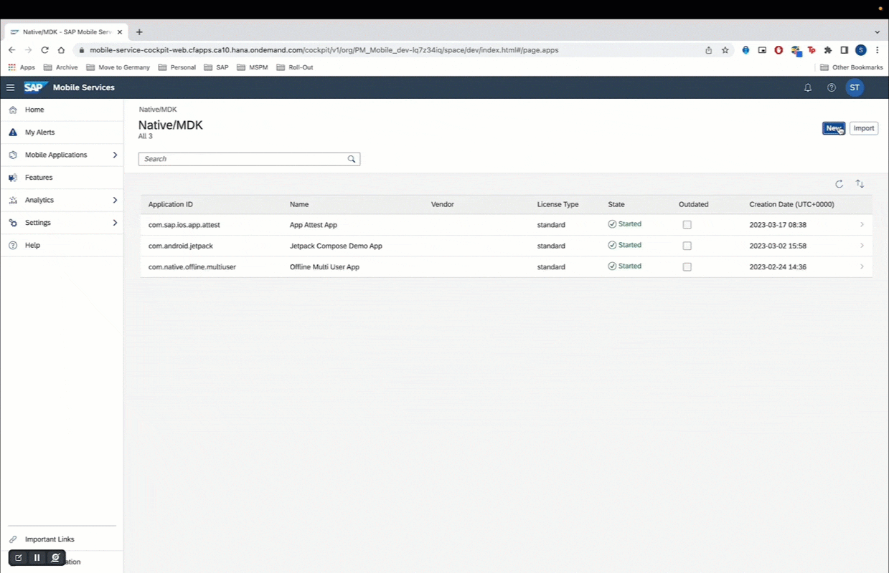
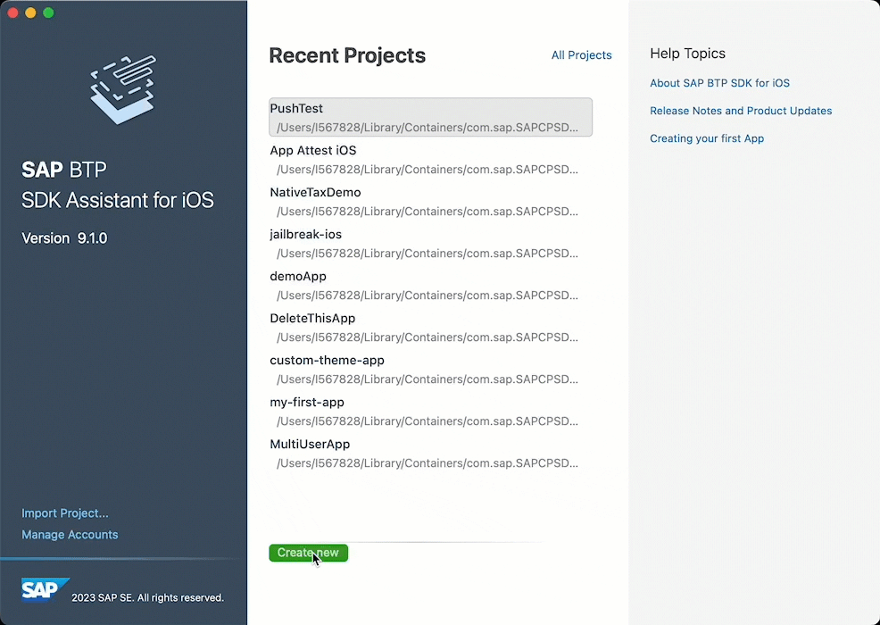
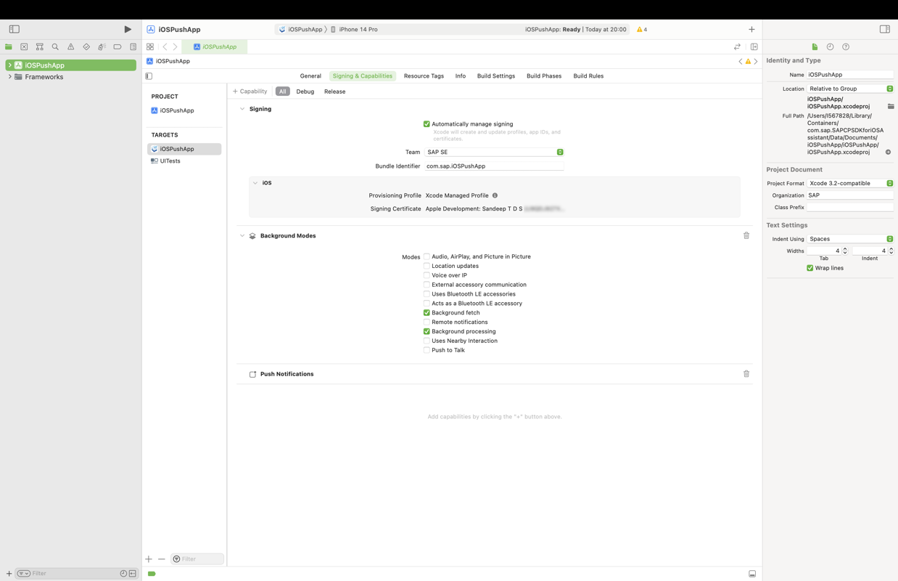
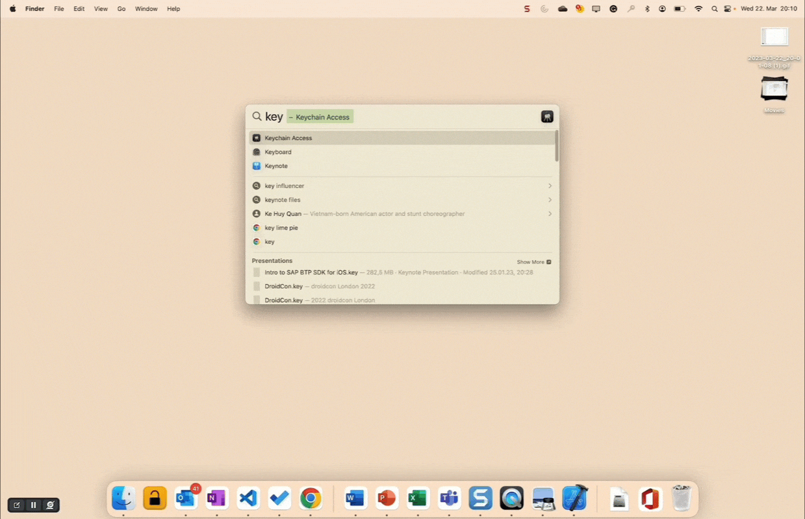
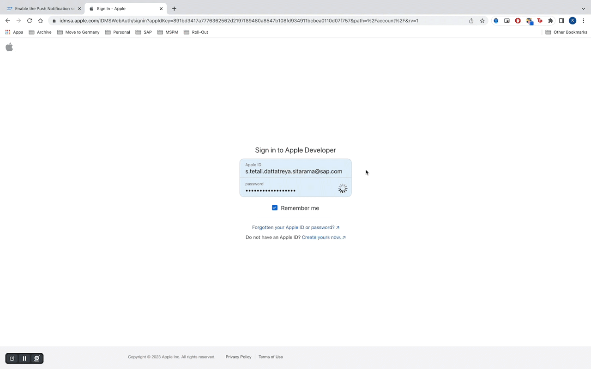
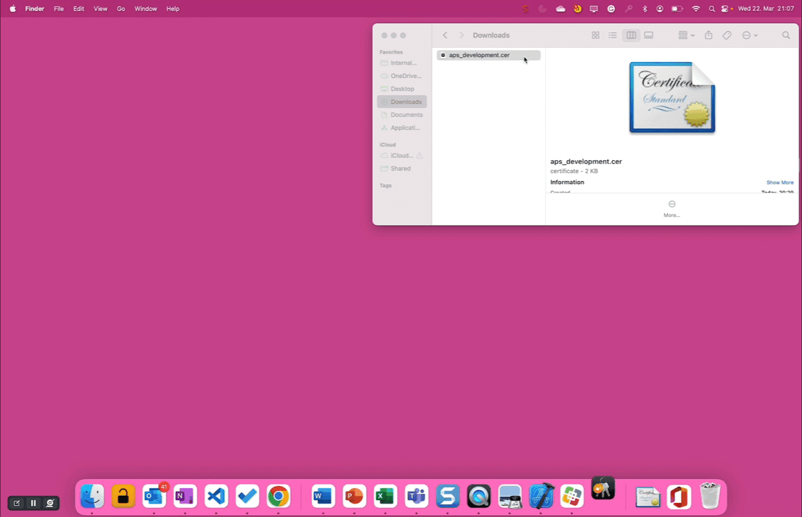
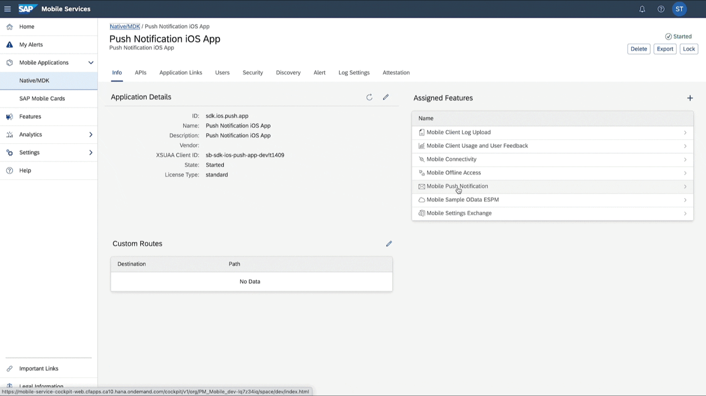
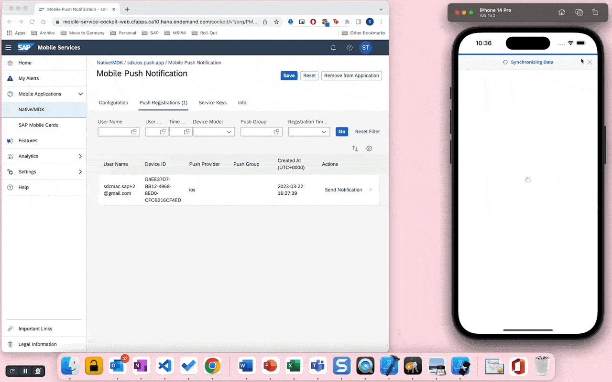
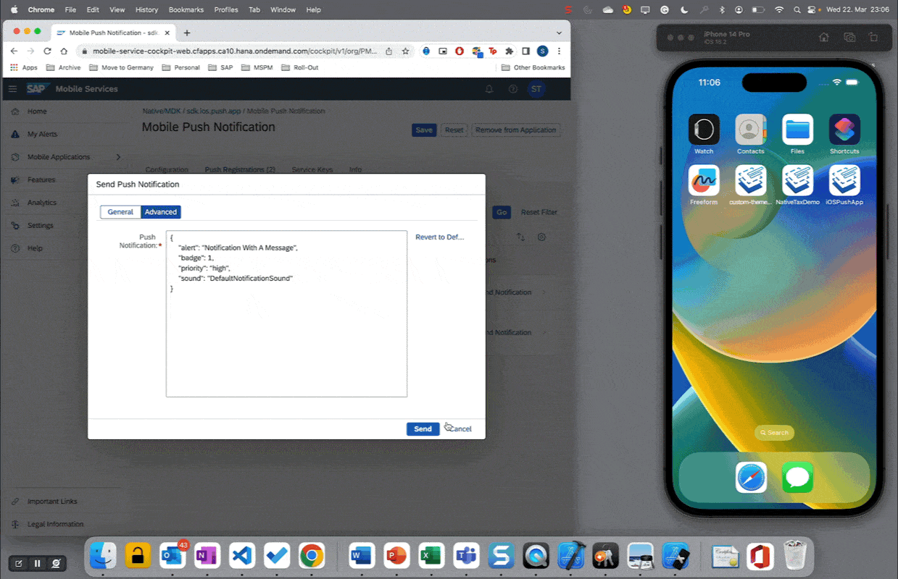

## Prerequisites

- [Set Up SAP BTP SDK for iOS](sdk-ios-setup)
- [Created Your First App using SAP BTP SDK Assistant for iOS](sdk-ios-assistant-app)
- [Apple Developer Account](https://developer.apple.com/programs/enroll/): *A paid Apple developer account is required*

## You will learn  

- How to configure push notifications on SAP Mobile Services
- How to send a push notification from SAP Mobile Services to you native iOS application

---

[ACCORDION-BEGIN [Step 1: ](Real world use case)]


You have built a native iOS application for a service technicians of a company that manufactures washing machines.

As a technician you are assigned an area to serve. To plan your work, you need to constantly be aware of the open issues in your region.

Therefore, you want to be notified immediately every time a new issue is created by the customer, even if you are not actively using the service technician app.

*In this tutorial, you will learn how to send push notifications to your mobile application using Apple Push Notification Service (APNS). Click [here](https://help.sap.com/doc/f53c64b93e5140918d676b927a3cd65b/Cloud/en-US/docs-en/guides/features/push/ios/push.html) to learn more about push capabilities on SAP BTP SDK iOS.*

[DONE]
[ACCORDION-END]

[ACCORDION-BEGIN [Step 2: ](Create server side app configuration)]

1. Click **Mobile Applications &rarr; Native/MDK** in the sidebar.

2. Click **New** located at the top right corner.

3. Use the following table to fill the details requested in the *New Application* Wizard.

    | Key | Value |
    |---|---|
    |ID|**`sdk.ios.push.app`**|
    |Name|**`Push Notification iOS App`**|
    |Description|**`Push Notification iOS App`**|
    |Vendor|*No Change*|
    |License Type|*No Change*|
    |Domain of Application Route|*No Change*|

4. Click **Next**.

5. Click **Next** on the *XSUAA Settings* step of the Wizard without making any changes.

6. Select **Native Application** in the *Assign Features for* drop down menu.

7. Enable **Mobile Sample OData ESPM** by selecting the check box in the features table.

8. Click **Finish**.



[DONE]
[ACCORDION-END]

[ACCORDION-BEGIN [Step 3: ](Create an Xcode project using SAP BTP SDK Assistant for iOS)]

1. Launch SAP BTP SDK Assistant for iOS.

2. Click **Create New** located near the bottom left corner.

3. Click **Reuse Existing Application** in the project template step.

4. Select the SAP Mobile Services account in which you created the server side configuration and click **Next**.

    >If prompted, use your SAP BTP credentials to complete the SSO login.

5. Select the app you created in the second step and click **Next**.

    >If prompted, use your SAP BTP credentials to complete the SSO login.

6. Use the following table to fill the project details requested in the *Provide the Xcode project configuration* step of the assistant, and click **Next**.

    | Key | Value |
    |---|---|
    |Product Name|**`iOSPushApp`**|
    |Organisation Name|**`SAP`**|
    |Organisation Identifier|**`com.sap`**|
    |Bundle Identifier|*Auto generated*|
    |Path|*No Change*|
    |Mac Catalyst|**Deselect**|

7. Click **Next**.

8. Click **Finish**.

    > If prompted, click **Trust and Open** in the warning pop-up to open the newly created Xcode project.



[DONE]
[ACCORDION-END]

[ACCORDION-BEGIN [Step 4: ](Configure Signing & Capabilities)]

1. Click the **`iOSPushApp`** `.xcodeproj` file to open the project configuration of your app.

2. Select **Signing & Capabilities Tab**.

3. Enable **Automatic manage signing**.

4. Select the correct Signing Certificate & Team.

   

[DONE]
[ACCORDION-END]

[ACCORDION-BEGIN [Step 5: ](Create a certificate signing request file)]

In order to use the **Apple Push Notification service**, we need to create a **CSR file**.

1. On your Mac, open the **Keychain Access** application.

2. Select Keychain Access > Certificate Assistant > **Request a Certificate From a Certificate Authority...**

3. Click **Continue** on the Introduction screen of the Certificate Assistant.

4. Use the following table to fill the details requested in the Certificate Assistant.

    | Key | Value |
    |---|---|
    |User Email Address|**`<Your Apple Developer Email ID>`**|
    |Common Name|**`TutorialPushCertificate`**|
    |CA Email Address|*No Change*|
    |Request is|**Save to disk**|
    |Let me specify key pair information|*No Change*|

5. Click **Continue**.

6. Select a location to save the certificate and Click **Save**.

7. Click **Done** on the Conclusion screen.



[DONE]
[ACCORDION-END]

[ACCORDION-BEGIN [Step 6: ](Create an APNS certficiate in your Apple developer account)]

1. Log into you [Apple Developer Account](https://developer.apple.com).

2. Click **Certificates** located under the *Certificates, IDs & Profiles* section.

3. Click **`➕`** located next to the Certificates heading to add a new certificate.

4. Select **Apple Push Notification service SSL (Sandbox)**.

    > If you are building a productive app, please select *Apple Push Notification service SSL (Sandbox & Production)*.

5. Click **Continue**.

6. Select the App ID (**`com.sap.iOSPushApp`**) that matches the bundle identifier in your Xcode project.

    > If you can't find the App ID, either confirm the team and certificate configuration is accurate in the Xcode project or create a new identifier and update the bundle identifier in your Xcode project.

7. Click **Continue**.

8. Click **Choose File** and upload the `TutorialPushCertificate` certificate signing request file created in the previous step.

9. Click **Continue**.

10. Click **Download** to download your `.cer`

    > The downloaded `.cer` file is issued by the *Apple Worldwide Developer Relations Certification Authority*.



[DONE]
[ACCORDION-END]

[ACCORDION-BEGIN [Step 7: ](Create a secure certificate file)]

1. On your mac, locate the downloaded **`.CER`** file.

2. Open the **`.CER`** file to install the certificate.

    > In case the **Add Certificate** dialog pops up make sure to choose **Login** from the dropdown and click on **Add**.

3. Right click on the newly added certificate and click **Get Info**.

4. Change the trust setting to **Always Trust** for the *While using this certificate option*.

5. Right click on the certificate and click **Export "Apple Sandbox Push Services: com.sap.iOSPushApp**.

6. Enter a file name **`TutorialPushCertificate`** and click **Save** to export the file.

7. Add a password and click **OK**.

    > You must provide this password to configure the certificate on SAP Mobile Services.



[VALIDATE_7]
[ACCORDION-END]

[ACCORDION-BEGIN [Step 8: ](Configure push notifcations on SAP Mobile Services)]

1. Go to you **SAP Mobile Services** admin cockpit.

2. Click **Mobile Applications &rarr; Native/MDK** in the sidebar.

3. Click **sdk.ios.push.app**.

4. Click **Mobile Push Notification** under *Assigned Features* section.

5. Select **Sandbox** for the *APNS Endpoint:* dropdown under *Apple* section.

   > This tutorial covers the [certificate based approach](https://developer.apple.com/documentation/usernotifications/setting_up_a_remote_notification_server/establishing_a_certificate-based_connection_to_apns).

6. Click **Browse** and upload the **`TutorialPushCertificate.p12`** file.

   > A `.p12` file is a encrypted container for the certificate and private key. This file is needed by Mobile Services for the `APNS` configuration.

7. Enter the configured *password*.

8. Click **Save**.



[VALIDATE_8]
[ACCORDION-END]

[ACCORDION-BEGIN [Step 9: ](Send a simple push notification to your phone)]

1. Click `▶` (Start the active scheme) in Xcode to run the application.

2. Complete the onboarding steps.

   > Please refer to the pre-requisite for a step by step guide for the onboarding flow.

3. Go to you **SAP Mobile Services** admin cockpit.

4. Click **Mobile Applications &rarr; Native/MDK** in the sidebar.

5. Click **sdk.ios.push.app**.

6. Click **Mobile Push Notification** under *Assigned Features* section.

7. Click **Push Registrations (x)**.

8. Click **Send Notification**.

    > If the number of registrations are more than one, click send notification for the device you can access.

9. Enter a message and click **Send**.

10. Tap the notification on your device to open the app.

    > Try sending a notification when the app is in background and not running.



> If you have configured your Apple Watch to display push notifications received on your iPhone, the push notification you have sent via Mobile Services will also be displayed on your Apple Watch.

[DONE]
[ACCORDION-END]

[ACCORDION-BEGIN [Step 10: ](Send an advanced push notifications)]

1. Go to you **SAP Mobile Services** admin cockpit.

2. Click **Mobile Applications &rarr; Native/MDK** in the sidebar.

3. Click **sdk.ios.push.app**.

4. Click **Mobile Push Notification** under *Assigned Features* section.

5. Click **Push Registrations (x)**.

6. Click **Send Notification**.

7. Select **Advanced** tab, and use the following `JSON`payloads.

    > The advanced option allows app developers to define icons, sound, title, badge number etc. Please refer to the [official documentation](https://developer.apple.com/documentation/usernotifications/setting_up_a_remote_notification_server/generating_a_remote_notification) for further details.

    ```json
    {
        "alert": "Notification With A Message",
        "badge": 0,
        "priority": "high",
        "sound": "DefaultNotificationSound"
    }
    ```

    ```json
    {
        "badge": 100,
        "priority": "high",
        "sound": "DefaultNotificationSound"
    }
    ```

    ```json
    {
        "alert": "Notification With Only A Message",
        "priority": "high",
        "sound": "DefaultNotificationSound"
    }
    ```

    

Congratulations on successfully completing the tutorial. You can now send push notifications to your native applications built using SAP BTP SDK for iOS.

[DONE]
[ACCORDION-END]
