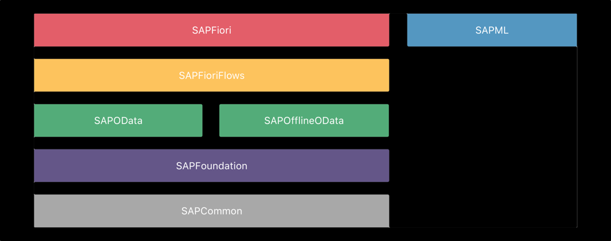
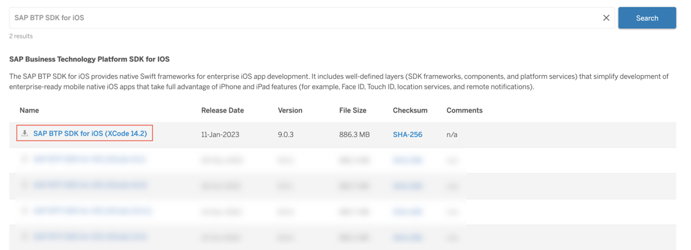
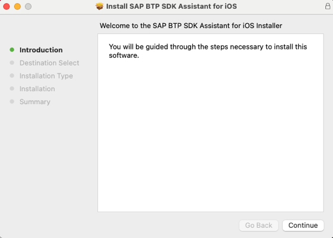
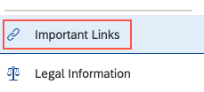
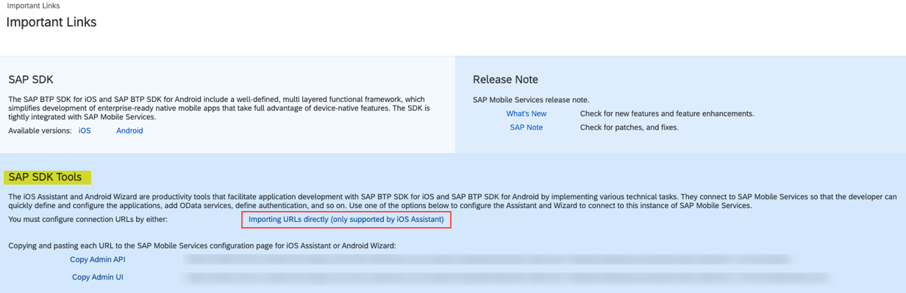
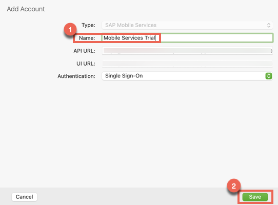
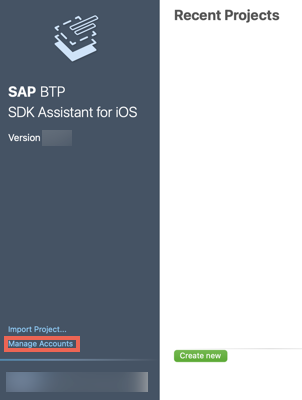

## Prerequisites

- macOS Monterey **12.5** or later
- Xcode **14.2** or higher
- [Account on SAP Mobile Services](fiori-ios-hcpms-setup)
- [Location](https://github.com/sap-tutorials/sap-btp-sdk-ios/issues) to raise issues found in the tutorial.

## You will learn  

- What is SAP BTP SDK for iOS
- How to download SAP BTP SDK for iOS
- How to install SAP BTP SDK for iOS
- How to connect SAP BTP SDK for iOS with SAP Mobile Services

---

[ACCORDION-BEGIN [Step 1: ](Download SAP BTP SDK for iOS)]

The SAP BTP SDK for iOS is a mobile development SDK built developed by SAP to enable developers to build business-ready native applications using familiar tools such as Xcode.

Developing an app with SAP BTP SDK for iOS allows you to focus more on app-specific logic by ensuring seamless integration with the SAP ecosystem through SAP Mobile Services.

The following table lists the key frameworks of SAP BTP SDK for iOS.

|  Framework                          | Description
|  :---------------------------       | :-------------
|  **`SAPFiori`**                     | [`API Reference`](https://help.sap.com/doc/978e4f6c968c4cc5a30f9d324aa4b1d7/Latest/en-US/Documents/Frameworks/SAPFiori/index.html)
|  **`SAPFioriFlows`**                |  [`API Reference`](https://help.sap.com/doc/978e4f6c968c4cc5a30f9d324aa4b1d7/Latest/en-US/Documents/Frameworks/SAPFiori/index.html)
|  **`SAPOData`**    | [`API Reference`](https://help.sap.com/doc/978e4f6c968c4cc5a30f9d324aa4b1d7/Latest/en-US/Documents/Frameworks/SAPOData/index.html)
|  **`SAPOfflineOData`**    | [`API Reference`](https://help.sap.com/doc/978e4f6c968c4cc5a30f9d324aa4b1d7/Latest/en-US/Documents/Frameworks/SAPOfflineOData/index.html)
|  **`SAPFoundation`**                | [`API Reference`](https://help.sap.com/doc/978e4f6c968c4cc5a30f9d324aa4b1d7/Latest/en-US/Documents/Frameworks/SAPFoundation/index.html)
|  **`SAPCommon`**                    | [`API Reference`](https://help.sap.com/doc/978e4f6c968c4cc5a30f9d324aa4b1d7/Latest/en-US/Documents/Frameworks/SAPCommon/index.html)
|  **`SAPML`**                        | [`API Reference`](https://help.sap.com/doc/978e4f6c968c4cc5a30f9d324aa4b1d7/Latest/en-US/Documents/Frameworks/SAPML/index.html)

Click [here](https://help.sap.com/doc/f53c64b93e5140918d676b927a3cd65b/Cloud/en-US/docs-en/guides/getting-started/ios/introduction.html) to view the **documentation** of SAP BTP SDK for iOS.

[DONE]
[ACCORDION-END]

[ACCORDION-BEGIN [Step 2: ](Download SAP BTP SDK for iOS)]

1. Click [here](https://developers.sap.com/trials-downloads.html?search=SAP+BTP+SDK+for+iOS) to go to the download section for SAP BTP SDK for iOS on developers.sap.com.

2. Click the first row to download the latest version.

    

    > The latest version may be different for you.

3. Complete the login process by providing your SAP Universal ID username and password.

4. Accept the End User License Agreement.

5. Click **Click here to start your download!**

   > Alternatively, you can also download the SAP BTP SDK from [SAP Software Center](https://launchpad.support.sap.com/#/products/73555000100900006345).

[DONE]
[ACCORDION-END]

[ACCORDION-BEGIN [Step 3: ](Install SAP BTP SDK for iOS)]

1. Extract the `.zip` file downloaded.

2. Launch the `.pkg` file located in the extracted folder.

3. Complete the steps in the installer.

    

[VALIDATE_3]
[ACCORDION-END]

[ACCORDION-BEGIN [Step 4: ](Connect to SAP Mobile Services)]

1. Go to your mobile services account.

    

    > If stuck, please review the second item in the pre-requisites of this tutorial.

2. Click **Important Links** located at the bottom of the sidebar.

    

3. Click **Importing URLs directly (only supported by iOS Assistant)** present under the SAP SDK Tools section.

    

    > Accept the browser pop-up to launch the SAP BTP SDK Assistant for iOS.

4. Enter a name and click Save.

    > You can connect to multiple accounts of SAP Mobile Services with your assistant. Thus, you must choose a name then enables you to identify the account easily.

   

   > You can manage (Create, Edit, Delete) the connections to all SAP Mobile Services accounts, by clicking **Manage Accounts** on the home screen of the assistant.
   >
   > 

[VALIDATE_4]
[ACCORDION-END]
