## Prerequisites  

- [Set Up SAP BTP SDK for iOS](sdk-ios-setup)
- [Created Your First App using SAP BTP SDK Assistant for iOS](sdk-ios-assistant-app)
- [Apple Developer Account](https://developer.apple.com/programs/enroll/): *A paid Apple developer account is required*

## You will learn  

- Add Custom Domains to your iOS Application
- Create an Apple App Site Associate File using SAP Mobile Services

---

[ACCORDION-BEGIN [Step 1: ](Real world use case)]


As a Vendor Manager, you oversee a web and mobile application that enables you to view, manage, and order products from vendors. When a vendor adds a new product using the web app, they notify you via email, providing a web app link to the newly added product for your approval.

As you primarily use the mobile application, you want to click on the link to open the product detail page on your application and perform the necessary action.

*This tutorial, will help you configure [Universal Links](https://developer.apple.com/ios/universal-links/) on iOS, thereby eliminating the need for the user to manually navigate to the product page. Click [here](https://help.sap.com/doc/f53c64b93e5140918d676b927a3cd65b/Cloud/en-US/docs-en/guides/features/application-links/admin/universal-links.html) to learn more about universal links on SAP BTP SDK iOS.*

[DONE]
[ACCORDION-END]

[ACCORDION-BEGIN [Step 2: ](Add associated domain capability)]

1. Select the `.xcodeproj` file of the project in Xcode.

    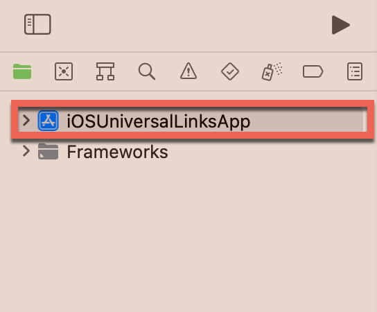

    > Ensure the app's signing is configured properly. The signing certificate details will be required in a later step.

2. Click **+ Capability** to add a new capability to your app.

3. Select **Associated Domains** to add the capability to the project.

   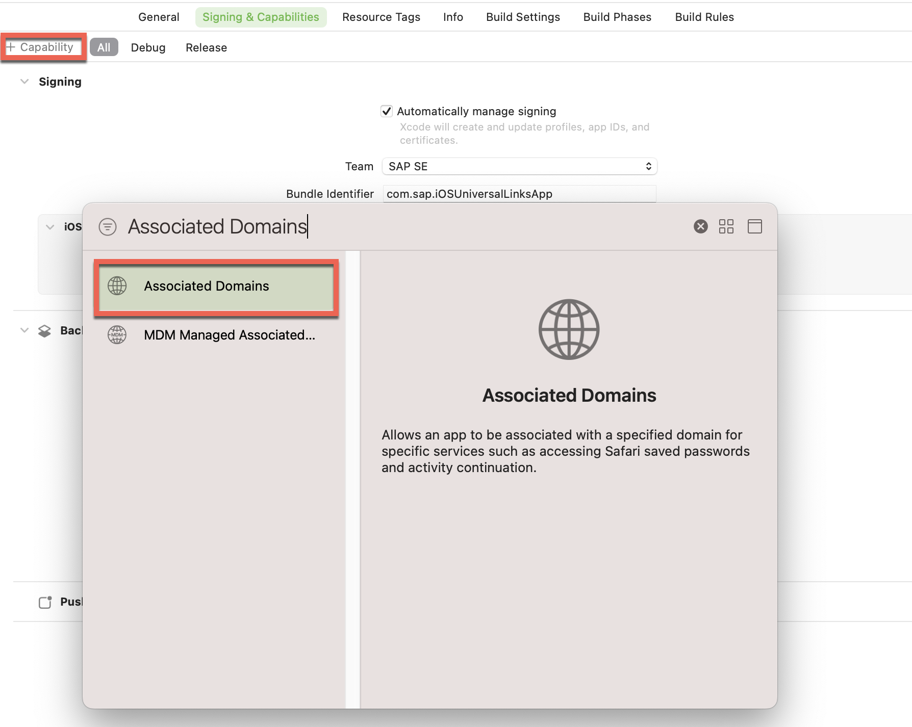

    > Xcode will now connect to the specified Apple Developer profile and register or update the App ID to use the Associated Domains capability.

[DONE]
[ACCORDION-END]

[ACCORDION-BEGIN [Step 3: ](Configure Application Links on SAP Mobile Services)]

1. Open **SAP Mobile Services** admin UI.

2. Click **Mobile Applications &rarr; Native/MDK** in the sidebar.

3. Click on your app (For example `com.native.links`).

   

4. Click **Application Links** tab.

5. Click on the pencil next to the **Apple Universal Links** section.

    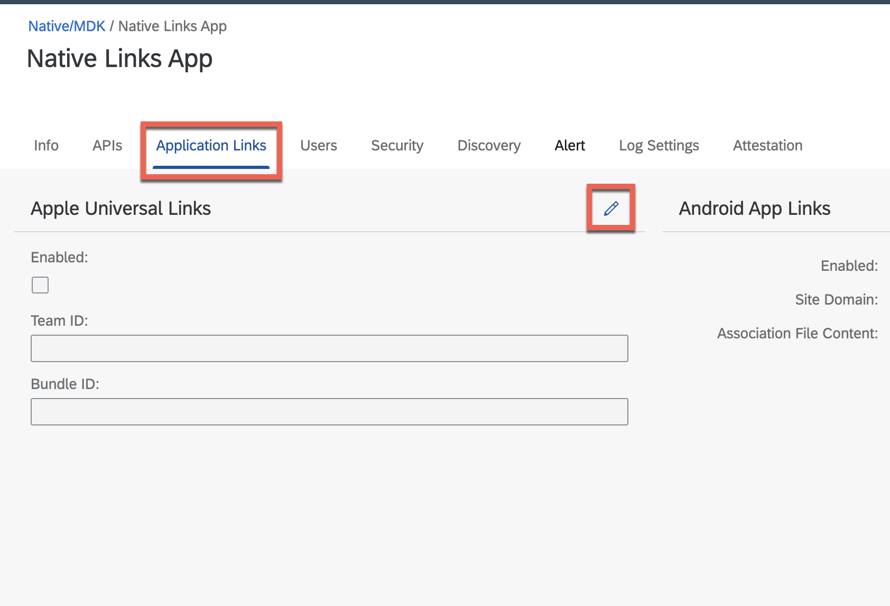

6. Use the following table to fill the details requested in the *Edit Apple Universal Links* form, and click **OK**.

    | Field Name | Value | Details |
    |----|----|----|
    | Enabled | Checked | |
    | Team ID | `<your_team_id>` | You can find this information on the Apple Developer website. 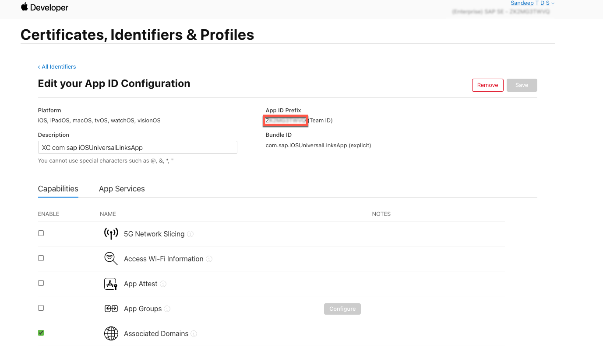 |
    | Bundle ID | `com.sap.iOSUniversalLinksApp` | You can find this information in the Signing Section of the `.xcodeproj` file. 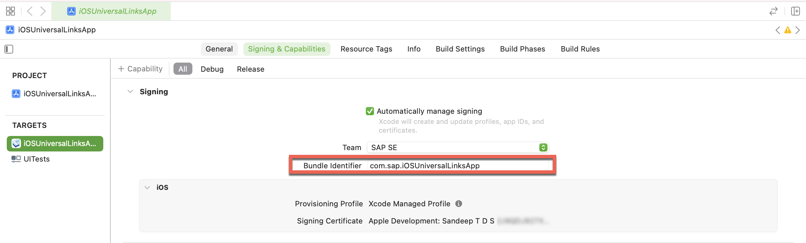|

[DONE]
[ACCORDION-END]

[ACCORDION-BEGIN [Step 4: ](Add custom associated domain to your app)]

1. Select the `.xcodeproj` file of the project in Xcode.

2. Click **+** icon located under the **Associated Domains** section of the *Signing & Capabilities* tab.

3. Use the following table to fill the details requested in the *Add Associated Domains* step.

    | Field Name | Value | Details |
    |----|----|----|
    | Domain | `applinks:<Server link from the APIs tab of your application on SAP Mobile Services>` | Don't include the https:// prefix. |

    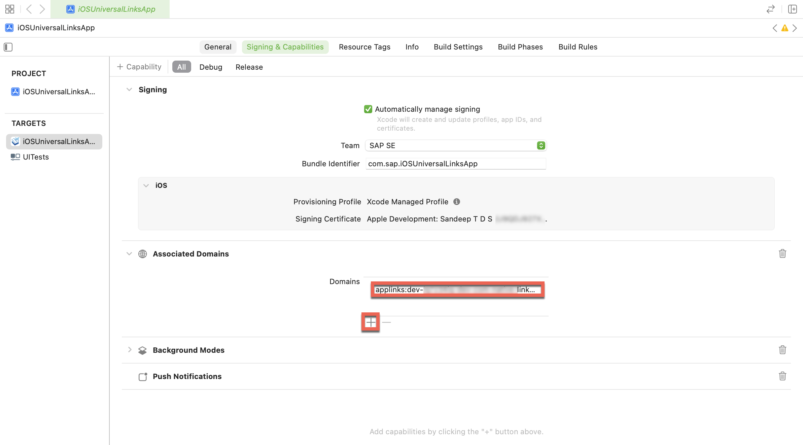

4. Verify that the associated domain is added to the  **`<app_name>.entitlements`** file located in you app folder.

    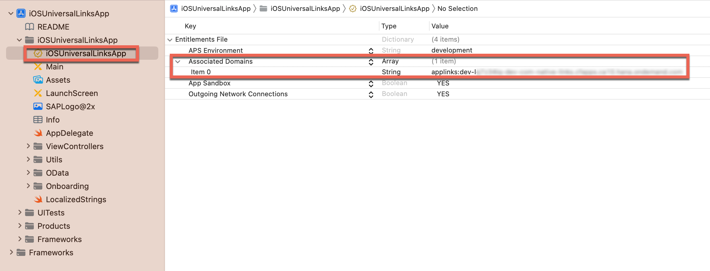

[DONE]
[ACCORDION-END]

[ACCORDION-BEGIN [Step 5: ](Check the AASA file)]

1. Go to you **SAP Mobile Services** Admin UI.

2. Click on your app (For example `com.native.links`).

3. Click **APIs** tab.

4. Copy the **Server** URL.

5. Open a new browser window.

6. Paste the **Server** URL and add the suffix `/`.

   >  The URL should look like `https://<YourUser-CFSpace-App>-com-example-tutorialapp.cfapps.eu10.hana.ondemand.com/.well-known/apple-app-site-association`

7. Go the above constructed URL.

    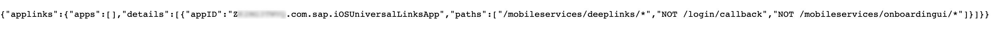

    > The AASA file is a JSON file on the web server of the associated domain. When a user clicks a Universal Link (web page link), iOS checks for the AASA file. If found and configured correctly, iOS opens the native app instead of the web page in the browser.
    > The asterisk at the end denotes a dynamic suffix.The app developer can write custom logic based on the suffix provided, for e.g. - product ID.

[VALIDATE_5]
[ACCORDION-END]

[ACCORDION-BEGIN [Step 6: ](Handle Deep Link)]

1. Open `AppDelegate.swift` on Xcode.

2. Add the following function to `AppDelegate` class:

    ```swift
    func application(_ application: UIApplication, continue userActivity: NSUserActivity, restorationHandler: @escaping ([UIUserActivityRestoring]?) -> Void) -> Bool {
        if userActivity.activityType == NSUserActivityTypeBrowsingWeb {
            let url = userActivity.webpageURL
            let host = url?.host
            let relativePath = url?.relativePath
            let lastPathComponent = url?.lastPathComponent

            // Handle the URL as per your app's logic
            if let lastPathComponent = lastPathComponent {
                switch lastPathComponent {
                case "product":
                    let alert = UIAlertController(title: "Product", message: "Product universal link.", preferredStyle: .alert)
                    alert.addAction(UIAlertAction(title: "OK", style: .default, handler: nil))
                    window?.rootViewController?.present(alert, animated: true, completion: nil)

                case "vendors":
                    let alert = UIAlertController(title: "Vendors", message: "Vendor universal link.", preferredStyle: .alert)
                    alert.addAction(UIAlertAction(title: "OK", style: .default, handler: nil))
                    window?.rootViewController?.present(alert, animated: true, completion: nil)

                default:
                    break
                }
            }

            return true
        }

        return false
    }
    ```

3. Click `▶` (Start the active scheme) in Xcode to run the application.

4. Complete the onboarding steps.

   > Please refer to the pre-requisite for a step by step guide for the onboarding flow.

[DONE]
[ACCORDION-END]

[ACCORDION-BEGIN [Step 8: ](Try the universal link)]

1. Go to you **SAP Mobile Services** Admin UI.

2. Click on your app (For example `com.native.links`).

3. Click **APIs** tab.

4. Copy the URL under the *Apple Launch App Code with Universal Link* section.

   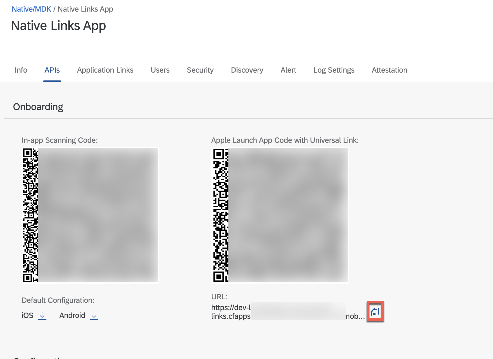

5. Open the **Reminders** App provided by iOS on your Simulator/Device.

   > If the app is running on a real device, choose any option that hyperlinks the URL text, for example, Mail, Notes, Reminders, etc.

6. Add the App Launch URL copied in the earlier step.

   > To ensure the URL is added as a hyperlink, please add the text in the main section of the reminder.

7. Click on the link.

   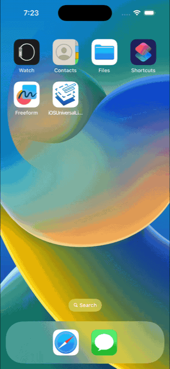

8. Add two more links to the Reminders app to test the deep-linking.

   - `.../com.native.links/config/product`
   - `.../com.native.links/config/vendors`

    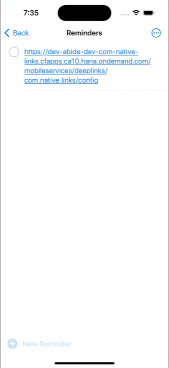

[DONE]
[ACCORDION-END]

Congratulations on successfully completing the tutorial. You can now configure universal links for your native applications built using SAP BTP SDK for iOS.

---
